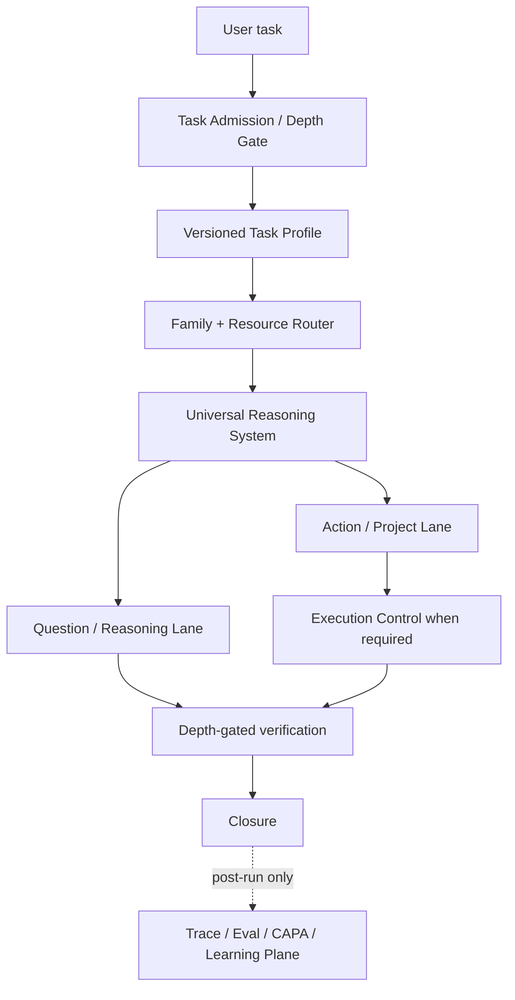

<div align="center">


# Reasoning Workflow

### Teach AI how to think before it searches.

**Understand the real problem. Allocate the right depth. Research what matters. Keep long-running work consistent.**

A general-purpose reasoning and Deep Research governing system for AI agents.

<br />

[](./skills/reasoning-workflow/SKILL.md)
[](#deep-research-is-model-driven)
[](#depth-first-routing)
[](#progressive-context-disclosure)
[](#semantic-runtime-for-long-running-work)
[](./LICENSE)

<br />

**English** · [简体中文](./README.zh-CN.md)

<br />

[Quick Start](#quick-start) · [Why](#why-this-exists) · [Architecture](#how-it-works) · [Depth](#depth-first-routing) · [Deep Research](#deep-research-is-model-driven) · [Families](#skill-families) · [Runtime](#semantic-runtime-for-long-running-work) · [Validation](#validation-status)

</div>

---

## The idea in 30 seconds

A lot of AI research still begins too late:

```text
user question
     ↓
keywords
     ↓
search
     ↓
more sources
     ↓
summary
```

The problem is simple:

> **If the model misunderstood the problem before it searched, more search can make the wrong answer look more convincing.**

Reasoning Workflow moves the starting point upstream — and adds one more decision before expensive work begins:

```text
user question / task
        ↓
lightweight Task Admission / Depth Gate
        ↓
understand the real task
        ↓
problem model / graph
        ↓
pivotal dependencies + relationships
        ↓
competing explanations + uncertainty
        ↓
evidence needs
        ↓
research / observe / use specialist skills
        ↓
update + challenge
        ↓
answer / decide / execute
        ↓
verify
```

> **Search is downstream of reasoning. Depth is downstream of the task.**

A short translation or direct calculation should stay light. A contested, causal, time-sensitive research problem can expand into Deep Research. A long-running multi-artifact task can add execution control, checkpointing, delegation, and recovery.

The system is universal. The machinery is proportional.

---

# Why this exists

Modern agents can search, code, analyze files, call tools, use specialist Skills, and delegate work. The harder problem is deciding **what should happen before those capabilities are used**.

Reasoning Workflow is designed around recurring failure modes:

- answering the wording of a prompt instead of the real question;
- decomposing a problem without being able to recompose the answer;
- treating correlation, dependency, mediation, causality, and feedback as the same thing;
- locking onto the first plausible explanation;
- searching by keywords instead of by evidence needs;
- counting repeated sources as independent confirmation;
- overthinking simple tasks and underthinking difficult ones;
- loading too much context because it might be relevant;
- letting workers, artifacts, tests, and conclusions drift out of sync during long work;
- declaring completion because the output looks finished rather than because the task is actually closed;
- “learning” from one bad run and silently changing future behavior.

The workflow treats these as one system problem: **reasoning quality, resource allocation, evidence quality, runtime integrity, verification, and learning must stay connected.**

---

# How it works



The Universal Reasoning Spine remains deliberately general:

```text
real task / outcome
→ orient when the frame is uncertain
→ build a revisable problem model
→ identify pivotal dependencies
→ decompose ↔ recompose
→ model relationships / causal chains
→ keep competing explanations alive
→ identify material uncertainty
→ derive evidence needs
→ reason / research / observe
→ update + challenge the model
→ synthesize / decide
→ answer or execute
→ verify
```

This is a dependency-aware map, not a mandatory linear checklist. New evidence can send the agent back upstream. Irrelevant steps can collapse to near-zero overhead.

---

# Depth-first routing

Every substantive task can enter Reasoning Workflow, but **universal entry does not mean universal full execution**.

The first step is a lightweight Task Profile. It keeps different dimensions separate instead of inventing one fake “complexity score”:

```text
depth class
reasoning breadth
evidence depth
challenge depth
verification depth
governance depth
frame uncertainty
freshness / volatility
causal / systemic complexity
task coupling
persistence / side effects
routing confidence
autonomy / authorization
```

The public depth classes are intentionally simple:

| Depth | Typical behavior |
| --- | --- |
| **Light** | Direct work. Often zero references. No ceremony. |
| **Standard** | Structured reasoning and normal verification where useful. |
| **Deep** | Broader modeling, evidence work, challenge, and independent review for material conclusions. |
| **Max** | Maximum *useful* depth, not “load everything.” May add orthogonal verification and more research routes when justified. |

Depth is dynamic. It may escalate when hidden complexity appears, or de-escalate when a task turns out to be simpler than expected.

The model forms the semantic Task Profile. Deterministic routing maps that structured profile to Skill Families and resources. Raw prompt keywords are not the deterministic classifier.

---

# Deep Research is model-driven

Reasoning Workflow began with a simple objection to keyword-first research:

> **Research should follow the structure of the problem, not merely the wording of the prompt.**

The core loop is:

```text
problem graph
     ↓
uncertain premise / causal edge / hypothesis
     ↓
explicit evidence need
     ↓
best evidence surface
     ↓
observe the underlying material
     ↓
update the problem model
     ↓
propagate consequences
     ↓
challenge / counterevidence
     ↓
next information-gain decision
```

## Frame uncertainty vs. answer uncertainty

These are different.

**Answer uncertainty:** the question is stable; the answer is unknown.

**Frame uncertainty:** the problem model itself may be missing an actor, mechanism, definition, time boundary, source ecosystem, incentive, confounder, or adjacent domain.

When frame uncertainty is material, the workflow allows **orientation retrieval** before a stable evidence plan exists. Once formal evidence retrieval begins, it expects a current problem model and an explicit evidence need.

That distinction prevents two opposite failures:

```text
keyword search too early
```

and

```text
bureaucratic “fill the model first” behavior that blocks useful orientation
```

## Evidence should discriminate, not accumulate

For a material claim, the workflow asks:

- Is the source actually in a position to know?
- Does the entity, version, time, population, and definition match?
- Are apparently independent sources copied from the same origin?
- Does this evidence distinguish competing explanations, or fit all of them?
- What observation would make the current conclusion change?

```text
20 sources that repeat the same origin
<
1 observation that separates two live explanations
```

Deep Research stops when another feasible inquiry is unlikely to materially improve the answer, confidence, decision, or important uncertainty. Source count, search count, agent count, and report length are never completion criteria.

---

# Skill Families

Detailed guidance is organized into six coarse Families. This is deliberate: the system stays universal without turning every reference into its own competing Skill.

| Family | Owns | Typical trigger |
| --- | --- | --- |
| **Core Reasoning** | framing, proportional depth, problem modeling, decomposition/recomposition, integration | substantive tasks |
| **Deep Research** | causal/system modeling, hypotheses, evidence needs, retrieval, provenance, uncertainty | external evidence, contested facts, frame uncertainty, Deep/Max research |
| **Decision Analysis** | objectives, constraints, alternatives, consequences, measurement, trade-offs | recommendation, prioritization, choice, decision |
| **Execution Control** | Plan, Schedule, delegation, authorization, durable state, checkpoint/recovery | persistent change, multi-artifact work, Swarm, side effects, long-running tasks |
| **Audit / Verification** | independent review, adversarial checks, workflow adherence, closure verification | Deep/Max verification, high-consequence work, explicit audit |
| **Workflow Learning** | CAPA, experience memory, routing heuristics, controlled improvement | post-run maintenance only |

The machine-readable map is [`routing-index.json`](./skills/reasoning-workflow/routing-index.json). Human-readable Family indexes live under [`families/`](./skills/reasoning-workflow/families/).

Reasoning Workflow owns **how work is framed, routed, integrated, verified, and closed**. Specialist Skills still own domain-specific implementation.

Examples:

```text
Reasoning Workflow + product design
Reasoning Workflow + coding / repository tools
Reasoning Workflow + data analysis
Reasoning Workflow + document / PDF / spreadsheet tooling
```

---

# Progressive context disclosure

The goal is not a smaller repository. The goal is a smaller, higher-signal **active model context**.

```text
Task Profile
    ↓
Family route
    ↓
current unresolved gap
    ↓
1–3 useful references for this phase
    ↓
return to router
```

Default behavior:

- Light work with no structured gap may load **zero references**.
- A normal phase should load only a small shortlist of useful references.
- Max can load more over time, but still progressively.
- `Related` links are navigation hints, not recursive load instructions.
- schemas, lifecycle policies, and validators stay in the machine layer whenever the model can invoke them rather than memorize them.
- reference loads can be traced with route, gap, and profile metadata so unused context can be measured instead of guessed.

---

# Two first-class lanes

## Question / Reasoning Lane

A question is a complete task.

```text
understand
→ model
→ reason / research
→ challenge
→ recompose
→ answer
→ verify
```

This lane covers fact checking, explanation, diagnosis, comparison, rumor verification, forecasting, Deep Research, judgment, recommendation, and other answer-oriented work.

It does **not** create project machinery merely because the reasoning is difficult.

## Action / Project Lane

Persistent change extends the reasoning lane:

```text
reason
→ decide what should happen
→ plan
→ authorize
→ schedule / delegate
→ execute
→ re-observe
→ verify
→ reconcile
→ effectiveness
→ close / reopen
```

Swarm is a scheduling strategy beneath this lane, not a third reasoning lane.

---

# Semantic runtime for long-running work

When durable execution is justified, the workflow adds deterministic controls around model reasoning.

Core runtime concepts include:

```text
Task Profile        — how much machinery should be active
Problem Model       — what the task currently means
Canonical State     — what is currently considered valid
Execution Plan      — what should be done
Execution Schedule  — who/what should do it, and when
Node State Ledger   — what has actually happened
Worker Proposal     — proposed findings/patches, not canonical truth
Checkpoint          — resumable semantic/runtime/workspace binding
Verification        — what exact state/content was checked
Learning Record     — validated reusable experience, not free-form self-editing
```

Two invariants matter especially:

> **Declared state is input. Effective state is computed.**

> **Validators certify structural admissibility and consistency — not epistemic truth.**

If an upstream premise, evidence item, relationship, artifact fingerprint, requirement, or verification becomes stale or invalid, dependent state is recomputed rather than silently remaining “current.”

---

# Serial, Swarm, degradation, and recovery

The same semantic Plan can execute in different schedules:

```text
same Plan
   ├── one Agent, serial
   ├── multiple Workers, parallel where independent
   └── degraded route when a capability is unavailable
```

Plan semantics are invariant under scheduling.

Workers may discover independently. They may not define canonical reality independently.

A Worker returns a structured proposal; a controller/validator checks version, contract, write-set conflicts, evidence, and verification before merging.

Checkpoint recovery follows:

```text
restore
→ verify checkpoint
→ re-check capabilities + authorization
→ re-observe volatile external state
→ inspect committed side effects
→ recompute stale state
→ reopen affected nodes
→ resume
```

Replay safety distinguishes safe, idempotent, detectable, and unsafe actions so interruption does not silently repeat irreversible side effects.

---

# Dual-layer verification

Verification depth is also proportional.

**Layer 1 — local / contract verification** checks whether the work correctly satisfies what it claims to satisfy: requirements, citations, calculations, tests, artifact contracts, versions, and coverage.

**Layer 2 — independent / adversarial verification** asks a different question: did the work actually solve the original problem, or did the solver and Layer 1 share the same blind spot?

Deep and high-consequence tasks can require a fresh reviewer. Max/high-consequence work can additionally require an orthogonal evidence, tool, model, deterministic, or human route when useful.

A second pass with the same context is not automatically independent verification.

Reviewer disagreement does not close by voting. It reopens the disputed node and creates a targeted evidence or verification need.

---

# Workflow adherence

A polished final answer is not proof that the workflow was followed.

The adherence layer checks observable protocol:

```text
state preconditions
+ required transitions
+ forbidden transitions
+ tool / resource loads
+ events
+ validator findings
```

For example, formal evidence retrieval should not silently occur without a valid evidence need. A restored task, however, does not need to recreate the same event if valid canonical/checkpoint state already satisfies the prerequisite.

This is deliberately different from logging private chain-of-thought. The system reasons over observable state, actions, evidence, artifacts, and transitions.

---

# Controlled learning

Reasoning Workflow can learn from experience without allowing one run to rewrite the canonical workflow.

```text
verified success / failure / recovery / inefficiency
        ↓
CAPA-style root-cause analysis
        ↓
candidate learning
        ↓
evaluation gates
        ↓
selective promotion or rejection
        ↓
rollback remains available
```

Three levels are separated:

- **Experience Memory:** validated strategy, recovery, and optimization lessons may be selectively retrieved.
- **Routing Heuristics:** changes to depth/reference routing require held-out evaluation and negative controls.
- **Canonical Workflow Changes:** changes to Skill instructions, schemas, policies, validators, authorization, or closure require regression evidence, baseline comparison, independent review, and rollback.

Same-model reflection without new evidence may create a **candidate insight**. It cannot validate itself.

See [`docs/LEARNING-POLICY.md`](./docs/LEARNING-POLICY.md).

---

# Quick Start

## Option 1 — use the repository source

```text
Read skills/reasoning-workflow/SKILL.md and use Reasoning Workflow as the governing process for this task.

My task:
[write the actual question or task]
```

For Deep Research:

```text
Use the Reasoning Workflow in this repository to investigate the question below.
Start from the real problem structure and evidence needs rather than keyword expansion.
Use the deepest useful level, but do not add process that does not improve the answer.

[my question]
```

## Option 2 — install the Portable package

Recommended default for most runtimes.

[`dist/reasoning-workflow-portable.zip`](./dist/reasoning-workflow-portable.zip)

It contains one `reasoning-workflow` Skill with the thin router, all Family indexes, progressive references, schemas, validators, runtime, tests, and evaluation adapters.

After installation:

```text
Use $reasoning-workflow as the governing workflow for this task:

[your task]
```

## Option 3 — install the Modular package

For runtimes that benefit from explicit Skill discovery and independent Family loading:

[`dist/reasoning-workflow-modular.zip`](./dist/reasoning-workflow-modular.zip)

It contains six installable Skills:

```text
reasoning-core
deep-research
decision-analysis
execution-control
audit-verification
workflow-learning
```

The six Skills are generated from the same source of truth and share machine semantics by hash.

> [!IMPORTANT]
> Portable and Modular are two distribution modes for the same system. They are not two independent implementations. Do not hand-maintain them separately.

---

# Which package should I use?

| Package | Best for | Trade-off |
| --- | --- | --- |
| **Repository source** | contributors, auditing, extending the workflow | full development tree |
| **Portable** | most users, archive upload, single-Skill runtimes, broad compatibility | one governing Skill owns routing internally |
| **Modular** | advanced runtimes with strong Skill discovery/composition | more on-disk duplication for self-contained Family Skills |

If you are unsure, use **Portable**.

---

# Repository structure

```text
.
├── README.md
├── README.zh-CN.md
├── LICENSE
├── CONTRIBUTING.md
├── PRIVACY.md
├── TERMS.md
│
├── skills/
│   └── reasoning-workflow/       # canonical source of truth
│       ├── SKILL.md
│       ├── families/             # six Family indexes
│       ├── references/           # progressive reasoning/research guidance
│       ├── schemas/              # typed machine contracts
│       ├── scripts/              # routing, runtime, validators, learning, build
│       ├── tests/                # regression / runtime / routing / context tests
│       ├── evals/deep-research/  # benchmark adapters and metric definitions
│       ├── agents/
│       └── assets/
│
├── dist/
│   ├── reasoning-workflow-portable.zip
│   └── reasoning-workflow-modular.zip
│
└── docs/
    ├── ARCHITECTURE.md
    ├── EVALUATION.md
    └── LEARNING-POLICY.md
```

The repository source is canonical. Distribution ZIPs are generated from it.

---

# Validation status

The current deterministic build includes:

- **44 / 44** discovered unit and regression tests passing;
- **24** behavioral specifications preserved;
- routing, context, adherence, learning, Deep Research contract, runtime, and distribution tests;
- portable ↔ modular shared semantic hash checks;
- ZIP integrity checks.

The current evaluation layer also verifies behaviors such as:

- Light tasks can remain light and load zero references;
- profile changes invalidate stale routes;
- `Related` does not cause recursive reference loading;
- evidence retrieval requires evidence needs while orientation remains possible under frame uncertainty;
- Skill defaults cannot override explicit user instructions outside separately governed safety/authorization constraints;
- fresh and orthogonal review are not treated as the same thing;
- intrinsic reflection cannot directly promote canonical learning;
- unsafe side-effect recovery respects replay-safety rules.

See [`docs/EVALUATION.md`](./docs/EVALUATION.md) for verification commands and evaluation boundaries.

## What is not yet proven

Deterministic tests validate the **workflow implementation**, not every model/runtime that may use it.

The following still require live, matched behavioral evaluation:

- real-model Task Profile classification accuracy;
- Skill trigger and Family/reference selection precision/recall;
- matched Deep Research generation-quality non-inferiority against the frozen baseline;
- real token, latency, and tool-call savings;
- measured error reduction from dual review;
- long-horizon learning effectiveness and harmful-memory rates;
- full external Deep Research benchmark execution;
- cross-runtime behavioral equivalence beyond deterministic semantic hashes.

The project intentionally keeps this boundary visible.

---

# Design principles

> **Search is downstream of reasoning.**

> **Universal entry does not mean universal full execution.**

> **Rigor is not ceremony.**

> **Plan semantics are invariant under scheduling.**

> **Workers may discover independently; they may not define canonical reality independently.**

> **Declared state is input; effective state is computed.**

> **Verification is valid only for the state/content it actually verified.**

> **Self-learning is controlled experience reuse, not automatic self-editing.**

> **A beautiful output is not proof that the workflow was followed.**

---

# Contributing

The preferred development pattern is regression-first:

```text
find a concrete failure
→ preserve the smallest counterexample
→ make the test fail
→ change the correct layer
→ make the test pass
→ run broader regression / eval
→ keep rollback possible
```

Before adding more instructions, ask whether the rule belongs in:

```text
Reasoning Core
Specialist Family/reference
Schema / policy / validator
Runtime / harness
Eval / trace system
```

See [`CONTRIBUTING.md`](./CONTRIBUTING.md).

---

# License, privacy, and terms

MIT License — see [`LICENSE`](./LICENSE).

Reasoning Workflow is a skill/workflow package and does not operate its own hosted backend. See [`PRIVACY.md`](./PRIVACY.md) and [`TERMS.md`](./TERMS.md).

---

<div align="center">

**Reasoning Workflow**

*Understand first. Research deliberately. Act proportionately. Verify what is actually true now.*

</div>
