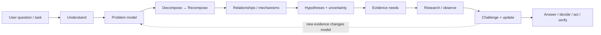
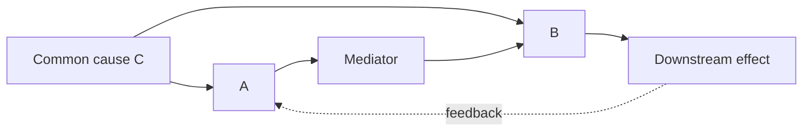
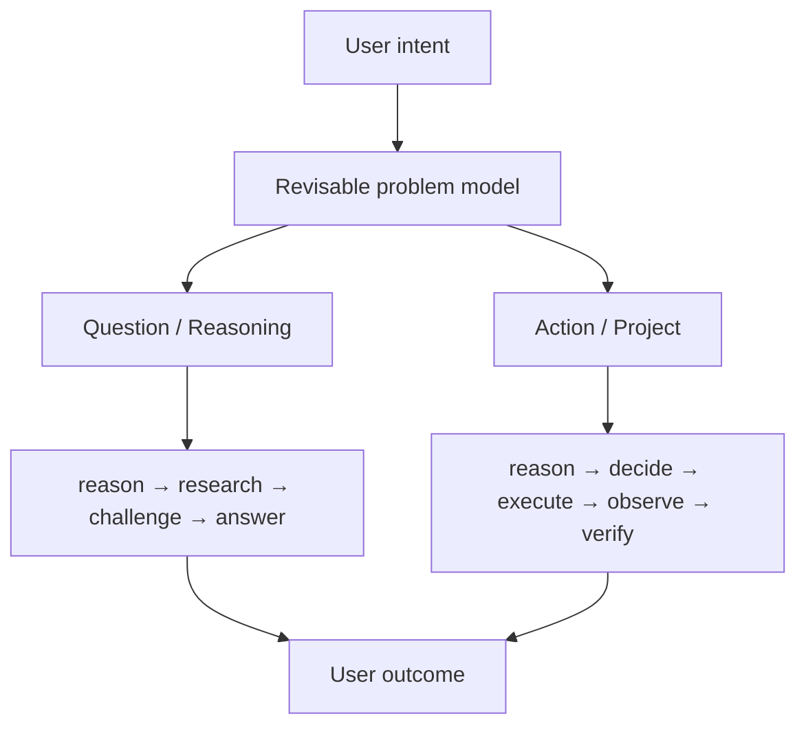

<div align="center">


# Reasoning Workflow

### Teach AI how to think before it searches.

**Understand the problem. Model the relationships. Research what actually matters.**

A general-purpose reasoning and Deep Research workflow for AI agents.

It teaches an agent to understand what the user is actually asking, decompose and recompose the problem, trace consequential relationships and causal structure, identify uncertainty and competing explanations, derive what evidence is actually needed, and only then search, challenge, synthesize, act, and verify.

<br />

[](./skills/reasoning-workflow/SKILL.md)
[](./skills/reasoning-workflow/SKILL.md)
[](./skills/reasoning-workflow/SKILL.md)
[](./skills/reasoning-workflow/scripts)

<br />

[Quick Start](#quick-start) ·
[Why](#why-this-exists) ·
[How It Thinks](#how-it-thinks) ·
[Deep Research](#deep-research-is-model-driven) ·
[Two Lanes](#from-deep-research-to-a-general-reasoning-workflow) ·
[Advanced Runtime](#advanced-runtime-for-long-running-work) ·
[Package](#package-structure)

</div>

---

## The idea in 30 seconds

A lot of AI research begins like this:

```text
user question
     ↓
keywords
     ↓
search
     ↓
more sources
     ↓
summary
```

That looks reasonable.

But there is a problem:

> **What if the model misunderstood the question before it searched anything?**

Then fifty sources do not necessarily help.

You can produce a deeply researched answer to the wrong question.

Reasoning Workflow moves the starting point upstream:

```text
user question / task
        ↓
understand the real problem
        ↓
build a revisable problem model
        ↓
decompose ↔ recompose
        ↓
map causal / dependency / constraint relationships
        ↓
identify uncertainty + competing explanations
        ↓
derive evidence needs
        ↓
research / observe
        ↓
challenge + update
        ↓
answer / decide / act
        ↓
verify
```

> **Search is downstream of reasoning.**

The agent should not begin by asking:

> “What keywords should I search?”

It should first ask:

> “What do I actually need to know — and why would knowing it change the answer?”

That is the core of this project.

---

## Quick Start

You do **not** need to learn the whole workflow before using it.

If your AI can read this repository, give it your actual task and tell it to load the Skill:

```text
Read skills/reasoning-workflow/SKILL.md and use it as the governing workflow for this task.

My task:
[write your question or task here]
```

Then ask whatever you actually care about.

For example:

```text
Read skills/reasoning-workflow/SKILL.md and use it as the governing workflow for this task.

My task:
Is this product really discontinued?

Don't just search the product name.
Investigate the strongest evidence, possible source propagation,
alternative explanations, and what would actually establish the answer.
```

Or simply:

```text
Use the Reasoning Workflow in this repository to deeply investigate:

[my question]
```

If the Skill is installed in a compatible agent runtime:

```text
Use $reasoning-workflow as the governing workflow for this task:

[your task]
```

If you attached the Skill as an archive rather than cloning the repository:

```text
Read reasoning-workflow/SKILL.md from the attached archive
and use it as the governing workflow for this task.

[your task]
```

> [!TIP]
> For most users, that is enough.  
> You do not need to manually operate the state model, validators, schemas, or advanced project machinery.

---

# Why this exists

## Deep Research often starts too late

The problem is usually not that an AI cannot search.

Modern agents can retrieve enormous amounts of information.

The harder problem is deciding:

- what the question really is;
- which parts of it actually matter;
- what depends on what;
- what is observation versus assumption;
- what mechanisms could explain the observation;
- which competing explanations remain plausible;
- what evidence could distinguish them;
- where that evidence is likely to exist;
- and when another search would no longer materially improve the answer.

Without that layer, “Deep Research” can easily become:

```text
prompt
→ keyword expansion
→ many searches
→ many sources
→ long synthesis
```

The output may look impressive while the underlying question was framed incorrectly.

Reasoning Workflow instead aims for:

```text
prompt
→ epistemic task
→ problem model
→ relationship model
→ uncertainty
→ hypotheses
→ evidence needs
→ retrieval
→ challenge
→ synthesis
```

More research is useful only when it produces **better understanding**.

---

# How it thinks



The problem model is **revisable**.

New evidence can change a premise.

A changed premise can change an inference.

A changed inference can change a judgment, decision, artifact, or verification result.

The workflow is therefore not a fixed chain of steps. It is an updating reasoning system.

---

## 1 · Understand what the user actually needs

The nouns in a prompt are not automatically the problem structure.

Before choosing tools, searches, categories, or execution steps, the agent first determines the actual epistemic task.

The user may be asking for:

```text
fact
verification
explanation
mechanism
interpretation
diagnosis
comparison
forecast
judgment
decision
recommendation
creation
execution
audit
```

Several can coexist.

A product recommendation may require:

```text
verification
+ comparison
+ measurement
+ decision analysis
```

A debugging task may require:

```text
observation
+ diagnosis
+ causal reasoning
+ implementation
+ verification
```

An unfamiliar research problem may begin with:

```text
concrete observations
        ↓
recurring patterns
        ↓
consequential relationships
        ↓
mechanisms
        ↓
abstractions / categories
```

The workflow prefers understanding before taxonomy.

Categories should compress understanding.

They should not replace it.

---

## 2 · Decompose — and then recompose

“Break the problem into smaller questions” is useful advice.

It is also incomplete.

An AI can generate ten beautifully organized subquestions and still completely miss the original problem.

So Reasoning Workflow applies a stronger test:

> **If every subquestion were answered perfectly, would those answers actually be sufficient to answer the original question?**

If the answer is no, the decomposition failed.

Good decomposition should preserve:

| Property | Question |
| --- | --- |
| Low overlap | Are multiple branches doing the same reasoning? |
| Material coverage | Is an answer-bearing dependency missing? |
| Stable analytic level | Are causes, symptoms, actors, outcomes, and actions being mixed arbitrarily? |
| Dependency visibility | Do we know which branches depend on which? |
| Recomposability | Can the branches actually reconstruct the parent answer? |

The goal is not:

```text
make a nicer outline
```

The goal is:

```text
reduce complexity
without destroying the structure needed to answer the question
```

---

## 3 · “Related to” is not enough

AI systems frequently say:

> “A is related to B.”

But **how**?

Reasoning Workflow distinguishes consequential relationships such as:

```text
causes
correlates_with
depends_on
enables
constrains
mediates
moderates
precedes
is_part_of
is_example_of
is_alternative_to
```

For harder problems, it can also inspect:

```text
upstream causes
common causes
downstream effects
feedback loops
delays
thresholds
confounding
selection effects
reverse causality
incentives
adaptation
expectations
path dependence
substitutes
complements
buffers
external forces
```

Consider:



Seeing that A and B move together is not enough to conclude:

```text
A → B
```

Maybe:

```text
C → A
C → B
```

Or:

```text
B → A
```

Or:

```text
A → mediator → B
```

Or the relationship only appears under a particular threshold, time horizon, incentive structure, or population.

This matters because:

> **Relationships determine what the agent should investigate next.**

The graph should not expand forever.

A relationship deserves more investigation when resolving it could materially change:

```text
interpretation
prediction
judgment
decision
design
recommendation
action
```

---

## 4 · Keep more than one explanation alive

A plausible story is not automatically the correct story.

Reasoning Workflow can combine:

```text
induction
observations → candidate pattern

abduction
observations → plausible explanation

deduction
hypothesis → predictions that should follow
```

The resulting loop is:

```text
observation
    ↓
pattern / candidate explanation
    ↓
competing hypotheses
    ↓
deduced predictions
    ↓
discriminating evidence
    ↓
revision
```

For a material conclusion, the agent should ask:

```text
What else could explain this?

What would each explanation predict differently?

What evidence would make me change my answer?

Which premise would collapse the conclusion if it were false?

What remains uncertain?
```

The first coherent explanation should not quietly become “the truth.”

---

# Deep Research is model-driven

This is the part the project originally began with.

Research should start from an **information need**, not a keyword list.

Before retrieving new evidence, the workflow asks:

### What do I not know?

Then:

### Why could that unknown change the answer?

Then:

### What observation would discriminate between the live explanations?

And finally:

### Where is the closest evidence surface to that observation?

That evidence surface may be:

```text
conversation context
user-provided files
repositories
source code
logs
tests
structured datasets
runtime experiments
official records
public web
academic literature
specialist reporting
community evidence
historical archives
```

Web search is one evidence surface.

It is not synonymous with research.

---

## Frame uncertainty vs. answer uncertainty

These are different.

### Answer uncertainty

The question is basically correct, but the answer is unknown.

```text
Question is stable
→ gather evidence
→ resolve answer
```

### Frame uncertainty

The current model of the problem itself may be wrong or incomplete.

The missing piece could be:

```text
an actor
a mechanism
a definition
an adjacent domain
a hidden dependency
a time boundary
a source ecosystem
an incentive
a confounder
```

When frame uncertainty is high, narrowing immediately can be dangerous.

Reasoning Workflow can instead use:

```text
ORIENT
  ↓
EXPAND
  ↓
MAP
  ↓
FOCUS
```

Explore enough to discover the real structure.

Then narrow.

---

## Evidence should be judged by position to know

A source is not strong simply because it looks authoritative.

For an important claim, ask:

```text
Was this source actually in a position to know?

Could its method observe the thing being claimed?

Does the time match?

Does the entity or version match?

Does the population match?

Is this observation, inference, hearsay, or copied reporting?

Are apparently independent sources actually one provenance chain?
```

For example:

```text
Article A ─┐
Article B ─┼──> Original source X
Article C ─┘
```

That is not three independent confirmations.

It is one underlying evidence origin repeated three times.

> **10 articles copying the same original source ≠ 10 independent confirmations.**

Likewise, an official source may be the strongest evidence for:

> “What does this institution officially state?”

while being weaker evidence for:

> “What actually happened operationally?”

Different propositions require different sources.

---

## Evidence should discriminate, not just accumulate

Imagine two explanations:

```text
H1 → predicts A, B, C
H2 → predicts A, B, D
```

Finding twenty more examples of `A` may add little information.

Finding whether `C` or `D` occurred may change everything.

So the workflow prefers evidence with high expected **information gain**.

Sometimes:

```text
1 discriminating observation
>
30 loosely relevant sources
```

Deep Research should reduce consequential uncertainty.

It should not merely produce a larger bibliography.

---

## Research should know when to stop

Source count is not a completion criterion.

Search count is not a completion criterion.

Report length is not a completion criterion.

Agent count is not a completion criterion.

The useful question is:

> **What is the expected answer gain from the next feasible inquiry?**

Research can stop when another realistic investigation is unlikely to materially change:

```text
the answer
the confidence
the decision
the recommendation
the important uncertainty
```

This prevents both premature stopping and endless research.

---

# From Deep Research to a general reasoning workflow

Reasoning Workflow began as an attempt to make Deep Research better.

Then the same failure appeared everywhere:

> **AI often acts before it understands.**

Coding.

Design.

Product analysis.

Market research.

Writing.

Planning.

Diagnosis.

Forecasting.

Decision support.

Long-running agent work.

The underlying discipline turned out to generalize.

That is why the project now has **two first-class lanes**.

---

## Question / Reasoning Lane

```text
understand
→ identify essence
→ model
→ premises
→ decompose / recompose
→ relationships
→ competing explanations
→ uncertainty
→ reason / research
→ challenge
→ synthesize
→ answer
→ verify
```

This lane is enough for many tasks:

```text
fact checking
explanation
interpretation
diagnosis
comparison
rumor verification
mechanism analysis
forecasting
judgment
recommendation
decision analysis
Deep Research
```

A difficult question may require hours of research.

It is still a complete question-answering task.

It does not need to be artificially turned into a project-management exercise.

---

## Action / Project Lane

When work changes persistent state or creates controlled artifacts, the cognitive lane extends into execution:

```text
understand
→ model / research
→ decide
→ assess risk
→ execute
→ re-observe
→ verify
→ validate
→ reconcile
→ evaluate effectiveness
→ close / reopen
```

Examples include:

```text
code changes
file modification
multi-artifact production
persistent configuration
long-running projects
multi-agent work
consequential external actions
handoff / recovery
```

The Action lane does **not** replace reasoning.

It begins with enough of the Question / Reasoning lane to understand what should be done.



---

# Adaptive depth

Using the workflow does not mean forcing maximum ceremony onto every request.

A simple question should stay simple.

Reasoning Workflow calibrates several dimensions independently:

| Dimension | Increase when |
| --- | --- |
| **Reasoning breadth** | multiple mechanisms, interpretations, actors, or boundary conditions matter |
| **Evidence depth** | facts are uncertain, changing, disputed, dispersed, quantitative, or consequential |
| **Challenge depth** | causal claims, forecasts, accusations, or fragile premises matter |
| **Verification depth** | errors are costly or exactness matters |
| **Governance depth** | work changes persistent state or spans artifacts, sessions, agents, or systems |

Convenient presets are:

```text
Light
Standard
Deep
Max
```

They are not fixed source counts or token budgets.

The workflow can expand and contract as the task changes.

Examples:

### Simple question

```text
understand
→ answer
→ check
```

### Difficult research question

```text
understand
→ orient
→ model
→ decompose / recompose
→ map relationships
→ derive evidence needs
→ research
→ challenge
→ synthesize
→ verify
```

### Long-running consequential work

```text
reasoning lane
→ controlled execution
→ re-observe
→ validate
→ reconcile
→ effectiveness
```

> **Rigor is not ceremony.**

---

# What kinds of questions can I give it?

Almost any substantive question where better problem understanding could improve the result.

### Rumor / verification

```text
“People are saying this product was discontinued because the original formula was lost.
Verify whether that is actually true.”
```

The workflow should distinguish:

```text
rumor
→ source propagation
→ official statement
→ operational evidence
→ alternative explanations
→ confidence
```

---

### Market / forecasting

```text
“Will memory prices keep rising?”
```

Instead of only searching:

```text
memory price forecast
```

the model may need to reason about:

```text
supply
capacity expansion
inventory
AI demand
contract pricing
spot pricing
node transitions
supplier incentives
substitution
lead times
macro demand
feedback
```

Those relationships determine the search plan.

---

### Product comparison

```text
“Which one should I buy?”
```

The workflow separates:

```text
technical specification
measurement validity
actual use case
constraints
trade-offs
uncertainty
decision relevance
```

The biggest benchmark number does not automatically determine the recommendation.

---

### Debugging

```text
“This frontend has several state inconsistencies.
Find the real failure mechanism before modifying code.”
```

The workflow can move from:

```text
symptom
→ observation
→ dependency
→ candidate mechanism
→ competing causes
→ discriminating test
→ fix
→ verification
```

instead of immediately editing the first suspicious line.

---

### Open-ended Deep Research

```text
“Research whether this industry is worth entering,
including important indirect relationships I did not mention.”
```

The workflow can explicitly investigate frame uncertainty before narrowing.

---

# Decision quality is separate from factual accuracy

Knowing what is true is not always enough to know what to do.

A recommendation may depend on:

```text
objectives
constraints
alternatives
consequences
trade-offs
uncertainty
reversibility
opportunity cost
sensitivity
value of more information
```

Reasoning Workflow therefore separates:

```text
evidence
↓
belief

from

belief + goals + constraints
↓
decision
```

It also separates a construct from its proxy:

```text
measurement validity ≠ decision relevance
```

A benchmark can accurately measure benchmark performance while still failing to represent the user's real workload.

---

# Advanced runtime for long-running work

Everything above is useful to ordinary users.

The following layer matters mainly when the task becomes persistent, mutable, multi-artifact, multi-agent, or consequential.

<details>
<summary><strong>Why long-running reasoning needs state semantics</strong></summary>

<br />

Suppose an earlier premise changes:

```text
P2 premise changed
       ↓
I3 inference
       ↓
J4 judgment
       ↓
A1 artifact
       ↓
V3 verification
```

If `P2` changes, the downstream records should not silently remain “current.”

They may need to become:

```text
stale
invalidated
superseded
pending re-evaluation
```

This is the bridge between good reasoning and long-horizon consistency.

A reasoning system that cannot propagate changed premises can produce a logically coherent answer at one moment and an internally inconsistent project ten turns later.

</details>

---

<details>
<summary><strong>Declared state vs. effective state</strong></summary>

<br />

One governing rule in the current runtime is:

> **Declared state is input. Effective state is computed.**

An agent can declare:

```text
question = answered
record = current
verification = passed
task = closed
delivery_ready = true
```

But those declarations should not override dependency structure.

For example:

```text
upstream premise = stale
↓
dependent inference declared "current"
```

The effective inference state should still be stale.

Likewise:

```text
task declared "closed"
+
material unresolved question
```

should not count as legitimate closure.

The semantic layer therefore reasons over:

```text
typed records
typed references
dependency edges
supersession
invalidation
materiality
temporal scope
verification
closure conditions
```

rather than trusting self-declared booleans.

</details>

---

<details>
<summary><strong>Preserved history + canonical current state</strong></summary>

<br />

For durable work, the model distinguishes historical evidence from current operational state:

```text
PRESERVED HISTORY
raw inputs
observations
events
previous decisions
        │
        ▼
CANONICAL CURRENT-STATE PROJECTION
questions
premises
evidence
hypotheses
uncertainty
decisions
requirements
actions
artifacts
verification
effectiveness
        │
        ▼
OUTPUT VIEWS
report
code
slides
UI
handoff
```

History answers:

> What happened and why?

Canonical state answers:

> What is currently true for the purpose of this task?

This distinction helps prevent old conclusions from silently competing with updated ones.

</details>

---

<details>
<summary><strong>What the validators can and cannot do</strong></summary>

<br />

The deterministic validation layer can inspect machine-checkable properties such as:

```text
dangling references
wrong-type references
invalid edges
forbidden cycles
stale-state propagation
unresolved closure blockers
delivery/state disagreement
missing verification
failed verification
state-version discontinuity
raw-lineage problems
```

It does **not** prove:

```text
that a premise is true
that the causal model is correct
that the source is honest
that a recommendation is wise
that the world matches the model
```

The validators enforce semantic and structural consistency around reasoning.

They are not a truth oracle.

</details>

---

# System invariants

For substantive work, Reasoning Workflow tries to preserve these qualities proportionately:

| Invariant | Meaning |
| --- | --- |
| **Traceable** | important conclusions and actions remain connected to their basis |
| **Readable** | a human or successor agent can understand the current model |
| **Synchronized** | upstream changes invalidate or update dependents |
| **Original-preserving** | raw/source material remains distinct from transformed descendants |
| **Complete** | the original question, requirements, blockers, and checks receive explicit disposition |
| **Consistent** | current state, evidence, answer, artifacts, and verification reconcile |
| **Recoverable** | long-running work can preserve enough state for resume or handoff |
| **Proportionate** | simple tasks remain lightweight |

These are invariants.

They are not a requirement to create a dozen files for every question.

---

# Specialist Skills compose with it

Reasoning Workflow is intended to sit **above** specialist capabilities rather than replace them.

```text
                Reasoning Workflow
                       │
        framing · inquiry · reasoning
      evidence · uncertainty · verification
                       │
       ┌───────────────┼────────────────┐
       │               │                │
     Coding       Product Design    Data Analysis
       │               │                │
       ├───────────────┼────────────────┤
       │               │                │
     PDFs          Retrieval        Domain Skills
       │               │                │
       └───────────────┼────────────────┘
                       │
                   User outcome
```

Examples:

```text
reasoning-workflow + coding
reasoning-workflow + product-design
reasoning-workflow + data-analysis
reasoning-workflow + PDF/document tooling
reasoning-workflow + domain research
```

The specialist capability owns the domain-specific operation.

Reasoning Workflow owns the cross-cutting process:

```text
understand
→ frame
→ calibrate effort
→ model
→ investigate
→ integrate
→ challenge
→ verify
→ reconcile
→ close
```

---

# Package structure

The Skill currently lives at:

```text
skills/reasoning-workflow/
```

Repository structure:

```text
.
├── README.md
├── CHANGELOG.md
├── CONTRIBUTING.md
├── PRIVACY.md
├── TERMS.md
├── .codex-plugin/
│
└── skills/
    └── reasoning-workflow/
        ├── SKILL.md
        ├── README.md
        │
        ├── agents/
        │   └── openai.yaml
        │
        ├── assets/
        │   └── icon.svg
        │
        ├── references/
        │   ├── problem-framing-and-effort.md
        │   ├── reasoning-structure-and-decomposition.md
        │   ├── relationships-and-systems.md
        │   ├── inquiry-and-research.md
        │   ├── hypotheses-and-bias-control.md
        │   ├── evidence-and-provenance.md
        │   ├── retrieval-and-observation.md
        │   ├── human-context-and-interpretation.md
        │   ├── time-scenarios-and-forecasting.md
        │   ├── multimodal-and-data.md
        │   ├── decision-and-recommendation.md
        │   ├── measurement-and-operationalization.md
        │   ├── state-model-and-invariants.md
        │   ├── semantic-state-contract.md
        │   ├── synchronization-and-recovery.md
        │   ├── runtime-and-delegation.md
        │   ├── traceability-and-integrity.md
        │   ├── change-governance-and-effectiveness.md
        │   ├── synthesis-execution-and-verification.md
        │   ├── formal-review-and-audit.md
        │   ├── domain-patterns.md
        │   └── worked-examples.md
        │
        ├── schemas/
        │   ├── work-state.schema.json
        │   ├── delivery-manifest.schema.json
        │   ├── event.schema.json
        │   ├── raw-record.schema.json
        │   └── edge-policy.json
        │
        ├── scripts/
        │   ├── semantic_core.py
        │   ├── validate_skill.py
        │   ├── validate_links.py
        │   ├── validate_state.py
        │   ├── validate_delivery.py
        │   ├── validate_events.py
        │   ├── validate_raw.py
        │   └── evaluate_run.py
        │
        └── tests/
            ├── test_validators.py
            └── cases/
```

`SKILL.md` is the runtime entry point.

The files under `references/` are specialist modules that are loaded when the task requires them.

---

# Reference routing

Specialist reference modules use a compact runtime contract.

Conceptually:

```text
Trigger
Reads
Updates
May invalidate
Must verify
Exit
Related
Return
```

This prevents the reference directory from becoming a collection of disconnected essays.

The root `SKILL.md` remains the governing router.

Specialist modules perform their work and return control to it.

---

# Validation

From the repository root:

### Validate the Skill package

```bash
python skills/reasoning-workflow/scripts/validate_skill.py \
  skills/reasoning-workflow
```

### Validate internal links

```bash
python skills/reasoning-workflow/scripts/validate_links.py \
  skills/reasoning-workflow
```

### Install semantic validation dependency

```bash
pip install -r skills/reasoning-workflow/scripts/requirements.txt
```

### Validate durable work state

```bash
python skills/reasoning-workflow/scripts/validate_state.py \
  path/to/work-state.json \
  --json
```

### Validate delivery consistency

```bash
python skills/reasoning-workflow/scripts/validate_delivery.py \
  path/to/work-state.json \
  path/to/delivery-manifest.json \
  --json
```

### Validate events

```bash
python skills/reasoning-workflow/scripts/validate_events.py \
  path/to/events.json \
  --state path/to/work-state.json \
  --json
```

### Validate preserved raw lineage

```bash
python skills/reasoning-workflow/scripts/validate_raw.py \
  path/to/raw-manifest.json \
  --root . \
  --json
```

### Run validator tests

```bash
python skills/reasoning-workflow/tests/test_validators.py
```

### Evaluate a behavioral run

```bash
python skills/reasoning-workflow/scripts/evaluate_run.py \
  skills/reasoning-workflow/tests/cases/<case>.json \
  path/to/run-artifact.json
```

Behavioral evaluation should rely on observable outputs, events, and state rather than hidden chain-of-thought.

---

# What this project is

Reasoning Workflow is:

```text
a problem-first reasoning workflow
+
a model-driven Deep Research process
+
an evidence and uncertainty discipline
+
a relationship / causal reasoning layer
+
a specialist-skill orchestration layer
+
an optional durable work-control system
+
machine-checkable semantics for the parts that can be checked
```

It is designed to help an AI:

```text
understand before acting
model before retrieving
search from information needs
challenge plausible stories
preserve dependencies
verify before declaring completion
```

---

# What it is not

It is not:

```text
a search engine

a requirement to browse the web for every question

a fixed checklist that every task must follow

a giant "think carefully" prompt

a replacement for domain-specific skills

a claim that deterministic validators can prove truth

a requirement to expose private chain-of-thought

a mechanism that magically grants unavailable tools,
permissions, persistence, or background execution
```

The workflow should use the smallest amount of machinery that preserves reasoning quality.

---

# Completion means different things in different lanes

## Question / Reasoning

A question is ready to close when:

```text
the original question was actually answered

decomposed branches can be recomposed

material claims are supported or bounded

important alternatives were challenged proportionately

remaining uncertainty is disclosed when material

another feasible inquiry is unlikely to materially improve the answer
```

## Action / Project

Persistent work may additionally require:

```text
requirements disposition
blocker disposition
artifact consistency
stale-state reconciliation
verification
delivery readiness
effectiveness
```

Implementation being finished does not automatically mean the intended change worked.

---

# Why this can be general-purpose

The project does not try to contain every domain method.

Its generality comes from operating one level above the domain.

Almost every substantive task has some version of these questions:

```text
What is the real problem?

What does the answer depend on?

What am I assuming?

What relationships matter?

What do I not know?

What evidence could change the answer?

What else could explain the observation?

What should I do with the result?

How do I know the result is still valid?
```

Coding and market research produce different answers.

Product design and historical investigation require different evidence.

A short factual question and a month-long agent project require very different amounts of process.

But the upstream reasoning discipline is surprisingly transferable.

That is the sense in which Reasoning Workflow is general-purpose.

---

# Design philosophy

The project began with a simple goal:

> **Make Deep Research better by teaching the model how to understand a problem before searching.**

Everything added later follows from the same idea.

Problem decomposition exists because the agent needs to reason about complex questions.

Recomposition exists because decomposition can destroy the parent problem.

Relationship modeling exists because keywords do not reveal causal structure.

Hypothesis competition exists because the first plausible story may be wrong.

Evidence provenance exists because repeated reporting is not independent confirmation.

Adaptive research exists because more search is not always more knowledge.

Durable state exists because good reasoning can be lost across a long-running task.

Semantic enforcement exists because an agent declaring something “done” does not necessarily make it true.

The machinery is downstream of the original goal.

It should never replace it.

---

<div align="center">

## Understand the problem.

## Model the relationships.

## Research what actually matters.

### Then act. Then verify.

<br />

**Reasoning Workflow**

[View the Skill](./skills/reasoning-workflow/SKILL.md) ·
[Explore the references](./skills/reasoning-workflow/references) ·
[View the tests](./skills/reasoning-workflow/tests)

<br />

<sub>
Built for agents that should do more than search harder — they should understand better.
</sub>

</div>
