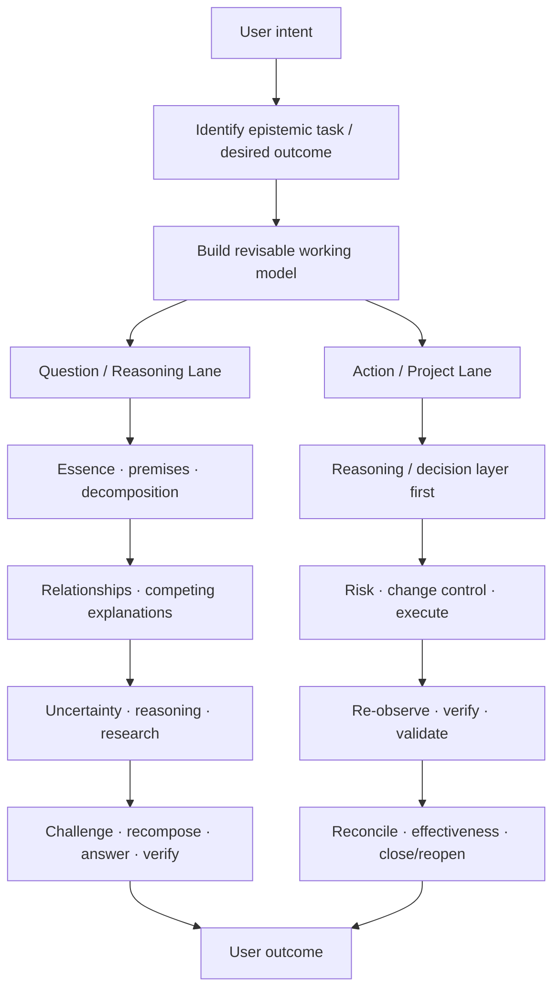
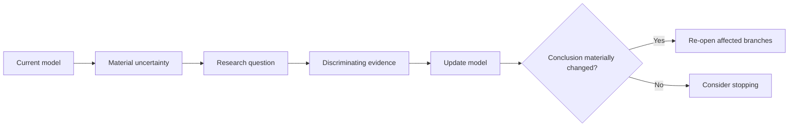

**A general-purpose reasoning and deep-research workflow for AI agents — designed to help agents understand problems before acting, research what actually matters, preserve epistemic structure, and keep long-running work consistent, traceable, and verifiable.**

> **Current release: V5 — Semantic Enforcement Release**

Reasoning Workflow began as a deep-research workflow and evolved into a general governing layer for substantive agent work.

Its core idea is simple:

> A capable agent must not only produce an answer or complete an action.
> It must understand what problem it is solving, know what its conclusions depend on, update those conclusions when the basis changes, and avoid declaring work complete when the underlying state is still incomplete or inconsistent.

Reasoning Workflow therefore treats two capabilities as equally important:

1. **Epistemic quality** — did the agent actually understand, reason about, research, challenge, and answer the problem?
2. **Runtime integrity** — can that reasoning, decision, execution, and verification remain traceable and internally consistent as the task evolves?

It is not just a prompt collection.

It is not just a deep-research recipe.

It is not just a project-management framework.

It is a **reasoning and work-control architecture for agents**.

---

## At a glance

Reasoning Workflow gives an agent:

| Capability                 | What it means                                                                                                         |
| -------------------------- | --------------------------------------------------------------------------------------------------------------------- |
| Problem understanding      | Identify what the user is actually asking before selecting tools or workflows                                         |
| Working-model construction | Separate facts, observations, premises, assumptions, hypotheses, inferences, judgments, recommendations, and unknowns |
| Adaptive research          | Research only when information is missing and prioritize evidence with high information gain                          |
| Relationship reasoning     | Explore causal, dependency, mediating, constraining, temporal, feedback, and alternative relationships                |
| Competing explanations     | Ask what else could explain the observation and search for discriminating evidence                                    |
| Evidence discipline        | Distinguish raw observations, source claims, agent inference, and final judgment                                      |
| Premise management         | Know what conclusions depend on and invalidate downstream reasoning when premises fail                                |
| Decision reasoning         | Separate “what should I believe?” from “what should I do?”                                                            |
| Semantic state             | Represent important reasoning and work objects as typed records                                                       |
| Transitive invalidation    | Propagate stale or invalid state through dependent reasoning and artifacts                                            |
| Closure gates              | Compute whether a question, project, or delivery is actually ready to close                                           |
| Traceability               | Connect requirements, evidence, reasoning, actions, artifacts, and verification                                       |
| Recovery                   | Preserve enough state for long-running work to resume or hand off                                                     |
| Behavioral evaluation      | Test observable workflow behavior without recording private chain-of-thought                                          |

---

## Quick start

The actual Skill lives at:

```text
skills/reasoning-workflow/
```

Its runtime entry point is:

```text
skills/reasoning-workflow/SKILL.md
```

### Use as an installed Skill

Use `skills/reasoning-workflow/` as the skill root in a compatible agent harness.

The package is structured so the root `SKILL.md` acts as the router while detailed reasoning, research, runtime, governance, and validation modules live under `references/`.

### Use as an uploaded ZIP

If your environment accepts Skill ZIPs, package the `reasoning-workflow` directory as the Skill root and upload it.

OpenAI's current Skills API supports both directory-based uploads and single Skill ZIP uploads.

### Use inside a normal chat

If the Skill is attached rather than formally installed, a suitable bootstrap instruction is:

```text
Read reasoning-workflow/SKILL.md and use it as the governing workflow for subsequent substantive tasks in this conversation.

Apply the core reasoning process to all substantive questions, but only activate heavy research, persistent state, change governance, or semantic validation when the task actually warrants them.

Load references, schemas, and scripts progressively rather than all at once.
```

### Use as a Codex skill-only plugin

The repository also includes:

```text
.codex-plugin/plugin.json
```

with:

```text
skills: "./skills/"
```

so the same Skill can be packaged through the current Codex plugin structure without changing its internal identity.

The Skill itself remains:

```text
reasoning-workflow
```

---

## Why this exists

Agent workflows often fail in one of two directions.

### Failure mode 1: research without state

An agent can search extensively and produce a polished report, while silently losing track of:

* which assumptions were used;
* which evidence supports which conclusion;
* which conclusions became stale after new evidence;
* whether the final artifact still reflects the latest decision;
* whether every original requirement was actually satisfied.

The result may look complete while its internal reasoning has drifted.

### Failure mode 2: process without reasoning

The opposite failure is also common.

An agent becomes good at:

```text
plan
→ execute
→ verify
→ close
```

but starts treating every question as a project.

It reaches for tools too early, follows the user's keywords too literally, applies fixed checklists, and weakens the more fundamental capability:

> understanding what the problem actually is.

Reasoning Workflow keeps both layers first-class.

---

# Two first-class lanes

The architecture has two equal entry paths.

A question is not a broken or shortened project.

**Answering a question is a complete task.**



## Question / Reasoning Lane

```text
understand
→ identify essence
→ model
→ premises
→ decompose / recompose
→ relationships
→ competing explanations
→ uncertainty
→ reason / research
→ challenge
→ synthesize
→ answer
→ verify
```

This lane is sufficient for tasks such as:

* factual questions;
* explanation and mechanism analysis;
* truth / rumor verification;
* comparison;
* diagnosis;
* interpretation;
* trend analysis;
* forecasting;
* conceptual analysis;
* scientific or technical inquiry;
* forming a reasoned judgment.

It does **not** automatically activate project governance.

## Action / Project Lane

When the user wants the agent to change persistent state, produce controlled artifacts, modify files, implement a system, or execute consequential work, the reasoning layer continues into:

```text
understand
→ model
→ research
→ decide
→ assess risk
→ govern change
→ execute
→ re-observe
→ verify
→ validate
→ reconcile
→ check effectiveness
→ close / reopen
```

The Action lane extends the reasoning lane.

It does not replace it.

---

# The reasoning kernel

Before searching or acting, the workflow attempts to determine the actual **epistemic task**.

The user may be asking for:

```text
fact confirmation
causal explanation
truth assessment
comparison
diagnosis
mechanism
forecast
decision
recommendation
interpretation
or direct reasoning
```

The first question is therefore not:

> Which tool should I call?

It is:

> What conclusion would actually answer the user's question?

---

## Build a revisable model before committing to an answer

The workflow distinguishes:

```text
fact
observation
premise
assumption
hypothesis
inference
judgment
recommendation
unknown
```

These roles should not silently collapse into one another.

For example:

```text
OBSERVATION
Sales increased after launch.

INFERENCE
The launch may have contributed.

HYPOTHESIS
The increase was caused primarily by the launch.

JUDGMENT
The launch was probably commercially effective.

RECOMMENDATION
Expand the campaign.
```

Each statement has a different epistemic status.

Evidence for the observation does not automatically prove the recommendation.

---

# Research is model-driven, not keyword-driven

High-quality work does not automatically mean “search the web more.”

The workflow first uses:

* information already provided by the user;
* available context;
* direct reasoning;
* existing observations and evidence.

Research begins when a material uncertainty remains.

The research loop is:



Before an important retrieval, the workflow should be able to answer:

```text
What do I currently not know?

Why could this unknown change the answer?

What evidence would support, distinguish, or falsify the current explanations?

What would I do differently after learning it?
```

Search paths therefore come from the problem model, not merely from the wording of the user's prompt.

---

## Frame uncertainty vs answer uncertainty

A central distinction is:

### Answer uncertainty

The question is correctly framed, but the answer is unknown.

```text
question known
→ answer unknown
```

### Frame uncertainty

The current understanding of the problem itself may be incomplete or wrong.

```text
problem space uncertain
→ orientation required
→ expand
→ map
→ then focus
```

When frame uncertainty is high, immediately narrowing to literal keyword search can produce a deeply researched answer to the wrong problem.

---

# Decompose — then prove that the decomposition recomposes

Complex questions are often decomposed.

But decomposition is not considered successful merely because the subquestions look reasonable.

The workflow applies a **recomposition test**:

> If every subquestion were answered perfectly, would those answers be sufficient to answer the parent question?

If not, the decomposition is incomplete, mis-leveled, overlapping, or aimed at the wrong abstraction.

The goal is not mechanical MECE compliance.

The preferred progression is often:

```text
concrete observations
→ recurring pattern
→ important relationships
→ mechanism / essence
→ abstraction / taxonomy
```

Classification is a compression tool.

It should not replace understanding.

---

# Induction, abduction, and deduction

The workflow explicitly allows multiple reasoning operators to interact.

### Induction

```text
observations
→ recurring pattern
→ tentative generalization
```

### Abduction

```text
observation
→ possible explanations
→ competing hypotheses
```

### Deduction

```text
hypothesis / mechanism
→ predicted consequence
→ testable observation
```

A common reasoning loop is therefore:

```text
observation
→ abduction
→ competing hypotheses
→ deduction
→ discriminating predictions
→ evidence
→ induction / revision
```

The purpose is to prevent the common failure pattern:

```text
first intuition
→ search for supporting evidence
→ confidence increases
```

without meaningful hypothesis competition.

---

# Typed relationship reasoning

“Related to” is too weak for serious reasoning.

The workflow distinguishes relationships such as:

```text
causes
correlates_with
depends_on
enables
constrains
mediates
moderates
precedes
is_part_of
is_example_of
is_alternative_to
```

For complex systems it can also explore:

```text
upstream causes
common causes
downstream effects
feedback loops
lags
thresholds
adaptation
expectations
path dependence
confounding
selection effects
reverse causality
substitutes
complements
buffers
```

But relationship exploration is aggressively pruned.

A relationship is worth following only when resolving it could materially change:

```text
explanation
prediction
judgment
decision
or action
```

---

# Competing explanations and discriminating evidence

For important explanatory claims, the workflow asks:

```text
What else could produce the same observation?

What would each explanation predict differently?

Which evidence best distinguishes between them?

What evidence would make me abandon the current explanation?
```

This turns research from evidence accumulation into uncertainty reduction.

Ten sources repeating the same proposition are not necessarily more useful than one observation that distinguishes two competing mechanisms.

---

# Source quality includes “position to know”

Source evaluation is not a simple prestige hierarchy.

The workflow asks:

> Is this source actually in a position to know this specific proposition?

Examples:

| Source               | Often strong for                                       | Often weak for                                                |
| -------------------- | ------------------------------------------------------ | ------------------------------------------------------------- |
| Official institution | official policy, formal specification, official action | independent evaluation of itself                              |
| Company              | product specification, announced changes               | unbiased assessment of user experience                        |
| Journalist           | reported event, sourced investigation                  | direct knowledge of hidden internal mechanisms unless sourced |
| Research paper       | measured relationship under its study design           | claims outside the measured population or design              |
| User community       | real experiences, failure modes, qualitative patterns  | population-wide prevalence                                    |
| Secondary summary    | orientation and discovery                              | replacing the primary evidence it summarizes                  |

The relevant question is not merely:

> Is the source authoritative?

but:

> Authoritative about **what**?

---

# Structured uncertainty

Uncertainty should not collapse into words such as “maybe” or “probably.”

The workflow distinguishes sources such as:

```text
missing evidence
source conflict
measurement uncertainty
definition / scope mismatch
premise uncertainty
model uncertainty
causal uncertainty
future behavioral uncertainty
external-variable uncertainty
```

Different uncertainty types require different responses.

For example:

```text
missing evidence
→ retrieval may help

definition mismatch
→ clarify construct before retrieving more

causal uncertainty
→ competing mechanisms / stronger design

future uncertainty
→ scenarios / signposts / monitoring
```

The workflow only tries to eliminate uncertainty when eliminating it is worth the cost.

---

# Challenge is part of normal reasoning

Falsification is not reserved for high-risk audits.

For any conclusion carrying material weight, the workflow asks proportionately:

```text
What evidence would make me change my answer?

Which premise, if false, would break the conclusion?

Is there a counterexample?

Does a competing explanation fit the same evidence?

Am I treating correlation, sequence, or association as causation?
```

Simple questions may pass this step almost instantly.

High-impact conclusions require substantially more challenge.

---

# Adaptive depth

The workflow is always conceptually active for substantive tasks.

**Heavy machinery is not.**

Depth is calibrated across five independent dimensions:

| Dimension          | Question                                                                                              |
| ------------------ | ----------------------------------------------------------------------------------------------------- |
| Reasoning breadth  | How much of the problem space and relationship structure must be explored?                            |
| Evidence depth     | How much external observation or retrieval is required?                                               |
| Challenge depth    | How aggressively should competing explanations and counterevidence be tested?                         |
| Verification depth | How much checking is needed before accepting the result?                                              |
| Governance depth   | How much traceability, authorization, reversibility, monitoring, and effectiveness control is needed? |

This means:

```text
simple question
→ understand → reason → answer → check
```

can remain simple.

While:

```text
high-uncertainty + high-impact + hard-to-reverse task
```

can activate much deeper research, challenge, verification, and governance.

Complexity comes from the problem.

Not from a fixed workflow length.

---

# Research stops by marginal information gain

Research does not stop after:

```text
N searches
N sources
N pages
```

It stops when another feasible research action is unlikely to materially improve the answer relative to its cost.

A useful stopping question is:

> If I learned the answer to the next unresolved question, is there a meaningful chance I would change the core explanation, judgment, prediction, or decision?

If not, continued retrieval has low expected value.

---

# Decision quality is not belief quality

Many real tasks eventually ask:

> What should I do?

This is different from:

> What is true?

The workflow separates:

```text
evidence
→ inference
→ belief / judgment
```

from:

```text
objective
→ alternatives
→ constraints
→ consequences
→ trade-offs
→ uncertainty
→ robustness / sensitivity
→ reversibility
→ opportunity cost
→ value of more information
→ recommendation
```

A belief may be uncertain while the decision is still robust.

A fact may be highly certain while the best decision remains unclear because user values or trade-offs are unresolved.

Objectives and value weights are therefore not silently invented as if they were evidence-derived facts.

When important preferences are unknown, a conditional recommendation may be more valid:

```text
If X matters most → choose A.
If Y matters most → choose B.
```

---

# Measurement validity is not decision relevance

The workflow also distinguishes:

```text
construct
→ operational measure
→ measurement validity
→ decision relevance
```

Examples:

```text
large market
≠ automatically attractive market

high benchmark score
≠ automatically good real-world task performance

higher engagement
≠ automatically higher user value

lower complaint rate
≠ automatically fewer underlying problems
```

A proxy can be accurately measured and still be the wrong thing to optimize.

---

# System invariants

When work becomes structured or persistent, the runtime layer attempts to preserve eight system properties.

| Invariant             | Requirement                                                                            |
| --------------------- | -------------------------------------------------------------------------------------- |
| Traceable             | Material conclusions and outputs can be traced to their inputs and reasoning basis     |
| Readable              | A human or successor agent can quickly understand current state                        |
| Synchronized          | Upstream changes invalidate or update dependent state                                  |
| Original-preserving   | Raw evidence remains distinct from transformations and inference                       |
| Complete              | Closure checks original questions, requirements, artifacts, verification, and blockers |
| Consistent            | Canonical state and required representations can be reconciled                         |
| Durable / recoverable | Long-running work can checkpoint, resume, and hand off where supported                 |
| Fast / proportionate  | Formal machinery activates only when it adds material value                            |

These are system properties.

They are not a requirement to create a large state file for every simple question.

---

# Canonical state and provenance

For durable work, the architecture separates:

```text
PRESERVED HISTORY
raw inputs
observations
state-change events
user steering
        │
        ▼
CANONICAL CURRENT STATE
        │
        ├── requirements
        ├── questions
        ├── premises
        ├── evidence
        ├── hypotheses
        ├── relationships
        ├── inferences
        ├── judgments
        ├── decisions
        ├── risks
        ├── actions
        ├── artifacts
        ├── verification
        └── effectiveness
```

The canonical state answers:

> What should the agent currently believe and act from?

Preserved history answers:

> How did the system get here?

Derived reports, files, code, presentations, or other artifacts should represent that state rather than becoming independent competing sources of truth.

---

# V5 — Semantic Enforcement

V5 freezes the main two-Lane cognitive architecture and shifts development toward executable semantics.

Two rules define the release:

> **Declared state is input. Effective state is computed.**

> **Validators certify structural admissibility, not epistemic truth.**

A record may declare:

```text
status = current
```

while its effective state becomes:

```text
effective_status = stale
```

because an upstream premise has been invalidated.


The purpose is not to make a formal system decide what is true.

The purpose is to prevent structurally invalid reasoning from silently presenting itself as current and complete.

---

# Semantic records

V5 can represent records including:

### Epistemic records

```text
Question
Answer
Observation
Evidence
Premise
Assumption
Hypothesis
Uncertainty
Relationship
Inference
Judgment
```

### Decision records

```text
Objective
Constraint
Alternative
Consequence
Measurement
Recommendation
Decision
```

### Runtime records

```text
Requirement
Risk
Action
Artifact
Verification
Effectiveness
Raw / Derived record
Event
```

References between records are typed rather than treated as arbitrary string IDs.

---

# Effective-state computation

V5 distinguishes declared state from computed state.

For example:

```text
Premise P-1
declared_status = invalidated
```

may propagate through:

```text
P-1
→ INF-2
→ JDG-4
→ REC-2
→ ART-7
→ VER-9
```

until the dependency graph reaches a fixed point.

Closure and delivery readiness are evaluated from effective state rather than trusting self-declared completion flags.

---

# Closure is computed

A Question-lane task cannot simply declare itself complete.

Epistemic closure can consider whether:

```text
root question is answered or bounded
material child questions are dispositioned
recomposition succeeds
question drift check passes
material uncertainties are resolved / bounded / explicitly irreducible
decisive dependencies are current
a current answer exists
```

Likewise, persistent work can be blocked from closure by:

```text
unsatisfied material requirements
stale artifacts
failed or missing verification
unresolved blocking risk
inconsistent delivery state
pending effectiveness where effectiveness is required
```

The goal is to distinguish:

```text
“the agent stopped”
```

from:

```text
“the task is actually admissible for closure”
```

---

# Semantic enforcement stack

V5 organizes machine validation into seven layers.

| Layer                    | Responsibility                                                           |
| ------------------------ | ------------------------------------------------------------------------ |
| 1. Type validity         | record shape, enums, typed references, local invariants                  |
| 2. Graph validity        | dependency semantics, cycle policy, lineage, reference integrity         |
| 3. Effective state       | stale propagation, invalidation, supersession, recomputation             |
| 4. Closure semantics     | epistemic closure, runtime closure, delivery reconciliation              |
| 5. Integrity             | event continuity, raw lineage, artifact/hash checks where available      |
| 6. Decision structure    | objectives, alternatives, consequences, trade-offs, value of information |
| 7. Behavioral evaluation | observable deterministic checks plus optional judge-based evaluation     |

Again:

> Passing these validators does not prove that an answer is true.

It means the represented state satisfies the structural rules the workflow claims to enforce.

---

# Raw evidence and lineage

Original material should remain distinguishable from its descendants whenever the environment supports it.

```text
RAW-001 original image
│
├── DER-001 crop
├── DER-002 enhancement
│      └── OCR-001
│
└── OBS-004 visual observation
       └── INF-003 inference
```

The intended rule is:

> Transformations create descendants, not silent replacements.

The same principle applies to:

```text
original document
→ edited working copy
→ delivery artifact
```

and:

```text
retrieved page
→ extracted passage
→ observation
→ inference
```

---

# Specialist skills remain specialist

Reasoning Workflow is an **orchestration / governing layer**.

It should compose with domain capabilities rather than replacing them.

Examples:

```text
reasoning-workflow
+ coding

reasoning-workflow
+ product-design

reasoning-workflow
+ pdf

reasoning-workflow
+ spreadsheets

reasoning-workflow
+ data-analysis
```

Reasoning Workflow owns questions such as:

```text
What is the real objective?
What assumptions matter?
What evidence is missing?
Which relationships matter?
What became stale?
What must be verified?
What would count as complete?
```

Specialist skills own the domain-specific implementation.

---

# Repository structure

```text
.
├── .codex-plugin/
│   └── plugin.json
│
├── .github/
│   └── workflows/
│       └── validate.yml
│
├── README.md
├── CHANGELOG.md
├── CONTRIBUTING.md
├── PRIVACY.md
├── TERMS.md
│
└── skills/
    └── reasoning-workflow/
        ├── SKILL.md
        ├── README.md
        │
        ├── agents/
        │   └── openai.yaml
        │
        ├── assets/
        │
        ├── references/
        │   ├── inquiry-and-research.md
        │   ├── reasoning-structure-and-decomposition.md
        │   ├── relationships-and-systems.md
        │   ├── evidence-and-provenance.md
        │   ├── decision-and-recommendation.md
        │   ├── measurement-and-operationalization.md
        │   ├── semantic-state-contract.md
        │   └── ...
        │
        ├── schemas/
        │   ├── work-state.schema.json
        │   ├── delivery-manifest.schema.json
        │   ├── event.schema.json
        │   ├── raw-record.schema.json
        │   └── edge-policy.json
        │
        ├── scripts/
        │   ├── semantic_core.py
        │   ├── validate_state.py
        │   ├── validate_delivery.py
        │   ├── validate_events.py
        │   ├── validate_raw.py
        │   ├── validate_skill.py
        │   ├── validate_links.py
        │   └── evaluate_run.py
        │
        └── tests/
            ├── test_validators.py
            └── cases/
```

---

# Validation

Semantic validators require Python 3.10+ and `jsonschema`.

From the Skill directory:

```bash
cd skills/reasoning-workflow

python -m pip install -r scripts/requirements.txt

python scripts/validate_skill.py .
python scripts/validate_links.py .
python -m unittest tests.test_validators -v
```

The validation suite is intended to check structural properties such as:

```text
Skill/package integrity
reference navigation
JSON Schema validity
typed-reference compatibility
dependency semantics
cycle policy
transitive invalidation
closure blockers
state ↔ delivery reconciliation
event continuity
raw lineage
artifact and verification references
```

GitHub Actions runs the core validation suite for repository changes.

---

# Behavioral regression

The repository also contains behavioral specifications under:

```text
skills/reasoning-workflow/tests/cases/
```

Cases cover scenarios such as:

```text
trivial question
deep open inquiry
rumor verification
human-statement interpretation
conflicting evidence
stale source
premise invalidation
question drift
decomposition / recomposition
interrupted work
user steering
partial failure
persistent change
ineffective change
multi-artifact drift
specialist-skill handoff
```

These cases are deliberately described as:

> **regression specifications, not proof of model behavior.**

A behavioral run can expose public observables such as:

```text
expected_events
forbidden_events
expected_final_state
expected_findings
```

This allows evaluation of workflow behavior without storing or evaluating private chain-of-thought.

---

# What this project does not claim

Reasoning Workflow does **not** claim that:

* a validator can prove a real-world conclusion is true;
* more process automatically produces better reasoning;
* every task should create persistent state;
* every question requires web research;
* every relationship is causal;
* every uncertainty can or should be eliminated;
* a generic workflow can replace domain expertise;
* hidden chain-of-thought should be recorded for audit.

The system is intended to improve reasoning discipline and structural integrity while remaining proportionate to the task.

---

# Design philosophy

The architecture follows several persistent principles.

### Think before retrieving

Use existing information and direct reasoning first.

Search because something important is unknown, not because “research” sounds rigorous.

### Mechanism before taxonomy

Understand the phenomenon before forcing it into a convenient classification.

### Evidence over source count

Prefer evidence that changes the model over more sources repeating the same claim.

### Relationships over literal keywords

Search the causal and dependency structure of the problem, not just the nouns in the prompt.

### Challenge before confidence

A conclusion becomes stronger when plausible alternatives fail, not merely when supporting evidence accumulates.

### Effective state over declared state

A downstream conclusion cannot remain current merely because its own record still says `current`.

### Closure over stopping

The agent stopping work is not evidence that the task is complete.

### Proportional rigor

The workflow should become more rigorous because the problem demands it, not because the framework contains many modules.

---

# Project status

**Current release: V5 — Semantic Enforcement Release**

The main Question / Reasoning and Action / Project architecture is considered stable.

Current development emphasis is therefore shifting away from adding more methodology prose and toward:

```text
stronger semantic contracts
typed state
dependency semantics
transitive invalidation
closure enforcement
state / artifact reconciliation
runtime integrity
behavioral evaluation
```

The long-term objective is not to formalize truth.

It is to make it harder for an agent to represent an obviously incomplete, stale, internally contradictory, or structurally unsupported reasoning state as finished work.

---

# Contributing

Contributions are most useful when they improve one of the following:

```text
semantic correctness
validator coverage
false-positive / false-negative behavior
regression cases
runtime interoperability
documentation clarity
special
```
