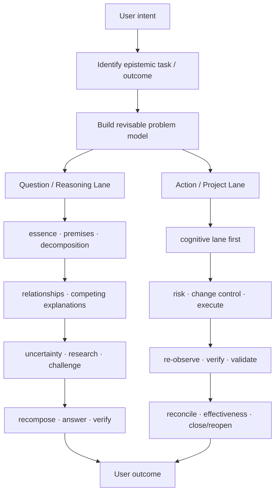
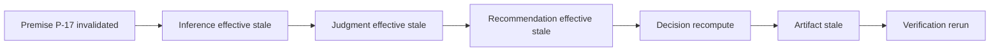

# Reasoning Workflow

**A general-purpose reasoning and deep-research workflow for AI agents — with adaptive inquiry, semantic state, traceable evidence, transitive invalidation, closure gates, and runtime validation.**

> Current release: **V5 — Semantic Enforcement Release**

Reasoning Workflow started as a deep-research skill and evolved into a governing process layer for substantive agent work. Its core premise is simple: a good agent must do two things well at the same time.

1. **Actually understand and reason about the problem.**
2. **Keep the resulting research, decisions, changes, artifacts, and verification structurally consistent when the task becomes persistent work.**

It is not just a prompt collection, and it is not just a project-management framework.

## Why this exists

Many agent workflows fail in one of two directions:

- they are good at searching and writing, but their assumptions, evidence, conclusions, and artifacts silently drift as the task evolves;
- they are good at execution and state management, but they turn every question into a procedural project and weaken open-ended reasoning.

Reasoning Workflow keeps both layers first-class.



## Two first-class lanes

### Question / Reasoning Lane

`understand → identify essence → model → premises → decompose/recompose → relationships → competing explanations → uncertainty → reason/research → challenge → synthesize → answer → verify`

**Answering a question is a complete task.** The agent does not need to enter project governance just because it is reasoning deeply.

### Action / Project Lane

The agent first performs enough of the reasoning lane to understand what should be done. Persistent work can then continue through:

`risk → change control → execute → re-observe → verify → validate → reconcile → effectiveness → close/reopen`

The Action lane extends reasoning; it does not replace it.

## What V5 adds

V5 freezes the main cognitive architecture and moves the engineering focus into **semantic enforcement**.

> **Declared state is input. Effective state is computed.**

> **Validators certify structural admissibility, not epistemic truth.**

The package now defines typed records such as Question, Answer, Premise, Hypothesis, Uncertainty, Relationship, Inference, Judgment, Objective, Alternative, Consequence, Decision, Recommendation, Artifact, and Verification.

A stale premise can therefore invalidate a downstream inference, judgment, recommendation, artifact, and verification through a fixed-point dependency calculation instead of relying on a single `stale=true` flag.



Closure is also computed. A task cannot merely declare itself `closed` while its root question is open, a material uncertainty is unresolved, or its current answer depends on effectively stale reasoning.

## Core reasoning principles

The workflow emphasizes:

- **epistemic-task identification** before tool selection;
- a revisable model of `fact / observation / premise / assumption / hypothesis / inference / judgment / recommendation / unknown`;
- **frame uncertainty** as distinct from simply not knowing the answer;
- decomposition with a **recomposition test**;
- induction, abduction, and deduction as complementary reasoning operators;
- typed relationships instead of generic “relatedness”;
- competing explanations and discriminating evidence;
- source **position to know**, not prestige alone;
- structured uncertainty and explicit reversal conditions;
- research driven by expected information gain rather than source counts;
- decision analysis that separates belief quality from decision quality;
- measurement checks that separate proxy validity from decision relevance.

## System invariants

For substantive work, the workflow aims to remain:

- **Traceable** — important requirements, premises, evidence, inferences, decisions, actions, artifacts, and verification can be traced to their basis.
- **Readable** — a human or successor agent can understand the current objective, model, blockers, and next action.
- **Synchronized** — upstream changes invalidate or update dependent state.
- **Original-preserving** — raw inputs remain distinct from transformed or inferred descendants.
- **Complete** — closure checks the original question or requirements, material blockers, artifacts, and verification coverage.
- **Consistent** — state, runtime observations, documentation, and deliverables are reconciled.
- **Durable / recoverable** — persistent work can checkpoint, resume, and hand off when the runtime supports it.
- **Fast / proportionate** — simple questions remain simple; heavy machinery activates only when warranted.

## Semantic enforcement stack

V5 uses a seven-layer acceptance hierarchy:

1. **Type validity** — record shape, enums, typed references, local invariants.
2. **Graph validity** — dependency semantics, cycle policy, lineage, reference integrity.
3. **Effective-state computation** — stale propagation, invalidation, supersession, recompute states.
4. **Closure semantics** — epistemic closure, runtime closure, delivery reconciliation.
5. **Integrity** — event continuity, raw lineage, artifact/hash checks where available.
6. **Decision quality structure** — objectives, alternatives, consequences, trade-offs, value of information.
7. **Behavioral evaluation** — deterministic observable checks plus optional judge-based evaluation.

## Repository layout

```text
.
├── .codex-plugin/plugin.json        # skill-only plugin wrapper
├── .github/workflows/validate.yml   # CI validation
├── README.md                        # public project overview
├── CHANGELOG.md
├── CONTRIBUTING.md
├── PRIVACY.md
├── TERMS.md
└── skills/
    └── reasoning-workflow/
        ├── SKILL.md                 # runtime entry
        ├── README.md                # deep package guide
        ├── agents/openai.yaml
        ├── references/              # reasoning + runtime modules
        ├── schemas/                 # semantic contracts
        ├── scripts/                 # validators + semantic engine
        ├── tests/                   # validator tests + 24 behavior specs
        └── assets/
```

## Use as a Skill

The runtime skill lives at [`skills/reasoning-workflow/`](skills/reasoning-workflow/).

For a harness that accepts a skill directory or ZIP, use that directory as the skill root. OpenAI's Skills API also accepts a directory upload or a single skill ZIP.

For a normal chat where the ZIP is attached rather than formally installed, a suitable bootstrap is:

```text
Read reasoning-workflow/SKILL.md and use it as the governing workflow for subsequent substantive tasks in this conversation. Load references, schemas, and scripts only when relevant.
```

## Use as a skill-only Codex plugin

The repository root includes `.codex-plugin/plugin.json` with `skills: "./skills/"`, following the current OpenAI plugin layout. The old `openai/skills` catalog is deprecated in favor of the current plugin distribution model.

Relevant official references:

- https://developers.openai.com/codex/plugins/build
- https://developers.openai.com/codex/skills
- https://github.com/openai/plugins

## Validation

Requires Python 3.10+; semantic validators use `jsonschema`.

```bash
cd skills/reasoning-workflow
python -m pip install -r scripts/requirements.txt
python scripts/validate_skill.py .
python scripts/validate_links.py .
python -m unittest tests.test_validators -v
```

GitHub Actions runs the same core checks on pushes and pull requests.

The validators intentionally do **not** claim to prove truth. They check things such as:

- typed record shape and reference compatibility;
- dependency/cycle policy;
- transitive invalidation;
- closure blockers;
- state ↔ delivery reconciliation;
- event continuity;
- raw lineage integrity;
- required artifacts and verification references.

## Behavioral regression

The repository contains 24 behavioral specifications under `tests/cases/`. They cover trivial tasks, open inquiry, rumor verification, human-statement interpretation, stale premises, question drift, decomposition/recomposition, persistent change, interrupted work, ineffective change, multi-artifact drift, and specialist-skill handoff.

The cases are **specifications, not proof**. V5 adds observable run contracts (`expected_events`, `forbidden_events`, `expected_final_state`, `expected_findings`) so actual agent runs can be evaluated without collecting private chain-of-thought.

## Design boundary

Reasoning Workflow is an orchestration / governing layer. It should compose with specialist capabilities rather than replace them — for example coding, Product Design, PDFs, spreadsheets, data analysis, or domain-specific research tools.

The workflow decides how the problem is framed, which evidence matters, when specialist capabilities are needed, how results are integrated, what becomes stale when premises change, and what must be true before closure.

## 中文简介

这是一个面向 ChatGPT、Codex 及其他 Agent 的通用 reasoning / deep-research 工作流。它把两件事同时作为一等公民：

1. **Agent 有没有真正把问题想明白**——问题本质、前提、关系、竞争解释、不确定性、调研和反证；
2. **长任务能不能稳定运行到底**——状态、同步、追溯、原始数据、恢复、完整性、一致性、验证和有效性。

V5 的重点已经从“继续增加思考方法”转向 **Semantic Enforcement**：对象有明确类型，引用有类型约束，上游前提失效会传递到下游，closure/readiness 由机器计算，而不是由 Agent 自己声明。

## Status

V5 is a semantic-enforcement release. The two-Lane cognitive architecture is considered stable; future work should favor stronger semantics, validators, runtime evaluation, and real behavioral evidence over adding more methodology prose.

## License

No open-source license has been declared yet. Public availability of this repository should not be interpreted as an automatic grant of reuse rights. Add an explicit license before broad redistribution or third-party packaging if that is the intended policy.
