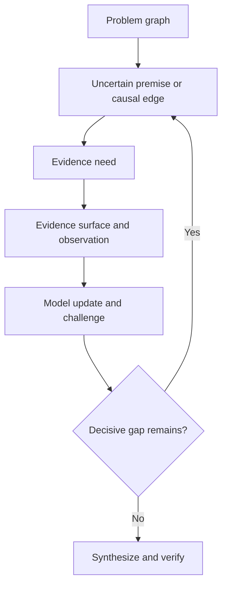

<div align="center">


# Reasoning Workflow

### Teach AI how to think before it searches

Understand the real problem. Allocate the right depth. Research what matters. Keep long-running work consistent

**English** · [简体中文](./README.zh-CN.md)

[Get started](#get-started) · [Examples](#put-it-to-work) · [How it works](#how-it-works) · [Validation](#validation-and-limits)

**[Download Portable](./dist/reasoning-workflow-portable.zip)** · [Download Modular](./dist/reasoning-workflow-modular.zip) · [Read the Skill](./skills/reasoning-workflow/SKILL.md)

</div>

---

## Better work starts before the tool call

An agent can collect good sources and still answer the wrong question. It can produce a convincing plan while missing a dependency, or keep using a conclusion after its evidence changes

Reasoning Workflow is a **governing Skill for reasoning, research, decisions, and execution**. It helps an agent decide what needs to be understood, what evidence would matter, which capabilities to use, and what to verify before calling the task done

It works alongside specialist Skills for coding, design, documents, and other domains. It does not replace them, provide its own model, or grant tools and permissions

**Simple tasks stay simple.** A direct calculation does not need a research plan. A difficult investigation should not be reduced to a keyword search

## Get started

### Copy this prompt to let your agent install it

Send this to your agent—no need to navigate the repository first

```text
Install and configure Reasoning Workflow in this environment
Repository: https://github.com/zy839971925-zyy/Agent--deep-research-Workflow-Skills

Read the repository README.md and skills/reasoning-workflow/SKILL.md first
Inspect the host's supported Skill / Plugin installation mechanism
Check for an existing instance before installing

Update an existing instance instead of creating a duplicate
Do not overwrite unsaved local changes
Default to Portable, the single governing Skill
Choose Modular only if this host supports composing multiple Family Skills
Prefer the host's supported installer; do not guess install paths or execute
uninspected remote scripts
If cloning source is needed, use a temporary directory and preserve the
complete relative resource structure required by the Skill

Complete installation directly where existing permissions allow
If authorization, sign-in, or a restart is needed, report the specific blocker
and the smallest necessary user action
If persistent installation is unsupported, explain the limit and use the
files for this session only if they are accessible

Verify that the entrypoint is readable, required resources exist, and the
host recognizes the Skill
Report the install location, source commit, actual checks, and any restart
still required
Do not equate downloading or reading the files with successful installation
```

This is an **installation request for an agent**, not a universal one-click API
Full automation depends on the host's capabilities and permissions

### Already working in this repository?

Give your agent this instruction, followed by your task:

```text
Read skills/reasoning-workflow/SKILL.md and use it to govern this task

Task: [what you want to know or accomplish]
Constraints: [relevant scope, sources, deadline, or permissions]
Deliverable: [the answer, decision, or artifact you need]

Choose a proportionate depth. Load supporting resources only when needed
```

The agent needs access to the actual files. Mentioning a path it cannot read does not load the Skill

### Using a downloaded package?

| Package | Choose it when… | What you get |
| --- | --- | --- |
| **[Portable](./dist/reasoning-workflow-portable.zip)** | You want one governing Skill; the recommended starting point | A self-contained `reasoning-workflow/` directory with internal Family routing |
| **[Modular](./dist/reasoning-workflow-modular.zip)** | Your runtime supports composing multiple Skills | Six Family Skills with shared machine semantics |
| **[Source](./skills/reasoning-workflow/)** | You want to inspect, validate, or contribute | The canonical Skill, resources, scripts, and tests |

Extract the package and use your runtime's supported Skill installation mechanism. For Portable, select the directory containing `SKILL.md`; for Modular, use the six directories under `reasoning-workflow-modular/skills/`

If your environment only supports file uploads, provide the extracted files—or the ZIP if it can unpack it—and ask it to read the entrypoint. **Reading an attachment is not persistent installation.** Avoid installing both formats for the same purpose

The repository also includes a [plugin manifest](./.codex-plugin/plugin.json) for compatible hosts. Installation, discovery, tool access, and persistence depend on the host

## Put it to work

You do not need to write a long prompt. State the outcome and the constraints that actually matter

### Investigate a claim

```text
Use Reasoning Workflow to investigate whether [claim] is true

Separate firsthand evidence from repeated reporting. Consider alternative
explanations and identify what evidence would change the conclusion
Deliver a sourced answer with the remaining uncertainty
```

### Make a decision

```text
Use Reasoning Workflow to compare [option A] and [option B] for [goal]

My constraints are [constraints]. Identify decisive trade-offs, separate
facts from assumptions, and explain when your recommendation would change
```

### Complete a bounded change

```text
Use Reasoning Workflow to implement [change] in this repository

Preserve [invariants]. You may modify [scope]
Verify the result and report what changed, what passed, and what remains open
```

For a small task, add “Keep this light.” For an investigation, specify the important uncertainty rather than asking for more sources. For execution, make the authorized scope explicit; the Skill does not supply missing permission

## How it works

The architecture combines **a Universal Reasoning System, Depth-Gated Skill Routing, Progressive Context Disclosure, a Deterministic Semantic Runtime, Dual-Layer Verification, and Eval-Gated Self-Learning**

### 1. Choose depth before spending effort

A lightweight **Task Admission / Depth Gate** forms a Task Profile. Reasoning, evidence, challenge, verification, and governance depth are considered separately. The profile can change as the task reveals new uncertainty

| Depth | Typical use | Verification |
| --- | --- | --- |
| **Light** | Direct, well-defined tasks | Minimal relevant check |
| **Standard** | Bounded analysis or implementation | Normal verification |
| **Deep** | Material uncertainty, causal questions, contested evidence | Layer 1 + fresh Layer 2 for material conclusions |
| **Max** | Explicit maximum useful depth or high-consequence work | Both layers, plus an orthogonal route where useful |

**Universal entry ≠ universal full execution.** Light tasks with no structured gap may load **zero references**. Max means maximum useful work, not maximum tokens, searches, or agents

### 2. Follow the problem, not just the prompt

The **Universal Reasoning Spine** connects framing, modeling, premises, decomposition and recomposition, relationships, uncertainty, evidence, challenge, synthesis, and verification. It is a revisable map, not a mandatory checklist

Deep Research starts from a **Problem Graph**: the claims, hypotheses, dependencies, and causal chains whose uncertainty could change the answer



For example, “Did the launch cause sales to fall?” calls for checking timing, measurement, comparison groups, and competing causes—not just searching the launch name

When the frame itself is unclear, **orientation retrieval** can first establish vocabulary and context. Formal **evidence retrieval** then follows an explicit evidence need: what observation would resolve an uncertain premise or distinguish explanations?

> Research should follow the structure of the problem, not merely the wording of the prompt

### 3. Load only what the current gap needs

Progressive Context Disclosure uses **Task Profile → Family Route → Current Gap → Small Reference Shortlist**. Normally, only the most relevant **1–3 references** are loaded for the current phase

| Skill Family | Use it for |
| --- | --- |
| [Core Reasoning](./skills/reasoning-workflow/families/core-reasoning.md) | Framing, models, premises, relationships, and synthesis |
| [Deep Research](./skills/reasoning-workflow/families/deep-research.md) | Evidence needs, inquiry, provenance, and competing explanations |
| [Decision Analysis](./skills/reasoning-workflow/families/decision-analysis.md) | Options, trade-offs, uncertainty, and recommendations |
| [Execution Control](./skills/reasoning-workflow/families/execution-control.md) | Dependencies, authorized changes, delegation, and recovery |
| [Audit / Verification](./skills/reasoning-workflow/families/audit-verification.md) | Contract checks, independent review, and closure |
| [Workflow Learning](./skills/reasoning-workflow/families/workflow-learning.md) | Post-run experience, CAPA, and evaluated improvements |

**Related ≠ automatic load.** Finish a reference, return to the router, and reassess the gap. Related links must not cascade into loading the entire library. See the [routing index](./skills/reasoning-workflow/routing-index.json)

Machine-heavy resources follow a separate rule: **machine uses it; model invokes it; model does not need to memorize it**

### 4. Answer questions or execute projects

There are only two first-class lanes:

- **Question / Reasoning Lane:** understand, investigate, synthesize, answer, and verify. A verified answer is a complete outcome
- **Action / Project Lane:** extend that reasoning with planning, authorized execution, re-observation, reconciliation, and closure

Agent Swarm is scheduling, not a third lane. Audit is a verification layer. Learning is post-run maintenance

<details>
<summary><strong>For long-running work: state, delegation, and recovery</strong></summary>

The **Semantic Runtime** supplies typed lifecycle rules, effective-state propagation, a canonical logical dependency graph, an Execution Node State Ledger, and closure checks

**Declared state is input. Effective state is computed.** Changed premises or artifacts can invalidate dependent results. Verification is bound to the fingerprint of the state or content actually checked

- **Plan / Schedule separation:** the Plan defines dependencies and contracts; the Schedule assigns timing and workers. Plan semantics are invariant under scheduling
- **Agent Swarm:** parallelize when dependency and context independence, shared mutable state, merge cost, failure isolation, and evidence diversity justify it—not merely because the task is complex
- **Worker proposals:** workers can discover independently but cannot independently write canonical reality. A manager/deterministic merger validates proposals and resolves conflicts before canonical state changes
- **Capability / Authorization separation:** an available tool is not permission to use it
- **Checkpoint / Recovery:** restore, re-observe, recompute effective state, then continue
- **Replay Safety:** side-effect receipts help govern retries so interrupted work is not blindly repeated

These are contracts and executable helpers, not an always-running orchestration service. A host must actually invoke the relevant runtime and validators to enforce them

Read the [governing Skill](./skills/reasoning-workflow/SKILL.md) and [semantic contract](./skills/reasoning-workflow/references/semantic-state-contract.md)

</details>

## Verify the work—not just the presentation

**Dual-Layer Verification** asks two different questions:

- **Layer 1:** does the work correctly satisfy its stated contract?
- **Layer 2:** does it solve the original problem, without question drift, missing branches, shared blind spots, provenance contamination, or new contradictions and unintended consequences?

The same solver rereading its answer in the same context is not automatically independent review. Reviewer disagreement reopens the disputed node for targeted verification; voting does not settle it

**Skill Adherence** is also separate from output quality. Check observable state preconditions, required and forbidden transitions, events, tool calls, resource loads, and validator findings. A polished answer is not proof that the workflow was followed. Private chain-of-thought is neither required nor an audit artifact

<details>
<summary><strong>Improve the workflow without automatic self-editing</strong></summary>

Controlled learning separates three tiers:

1. **Experience Memory:** retain useful, bounded lessons
2. **Routing / Reference Heuristics:** evaluate improvements to resource selection
3. **Canonical Workflow Change:** require a candidate, minimal failing regression, offline/shadow evaluation, baseline comparison, independent review, promote/reject decision, and rollback

**Self-Learning ≠ Automatic Self-Editing.** A single “generate → reflect → rewrite the Skill” loop cannot promote a canonical change

Material workflow failures use **CAPA**: containment, root cause, corrective action, regression, verification, effectiveness check, prevention/generalization, and closure. One passing test does not establish effectiveness

See the [learning policy](./docs/LEARNING-POLICY.md)

</details>

## Validation and limits

Current reproducible status:

- **58/58** discovered unit and regression tests pass
- Skill structure, local links, and workflow metadata checks pass
- Portable/Modular shared semantic consistency and ZIP integrity checks pass

**These are deterministic implementation checks, not live-agent behavioral benchmarks**

Still unvalidated: real-model Task Profile classification; Skill trigger precision/recall; cross-model Family/reference routing; matched Deep Research quality non-inferiority; real token/latency savings; dual-review error reduction; long-horizon learning effectiveness; and complete external Deep Research benchmark execution

See [evaluation commands and boundaries](./docs/EVALUATION.md) and [Deep Research evaluation definitions](./skills/reasoning-workflow/evals/deep-research/). Performance depends on the model, host integration, available evidence, and actual adherence

## For contributors

The only canonical source is [`skills/reasoning-workflow/`](./skills/reasoning-workflow/). Portable and Modular are generated outputs, never independently maintained implementations

From the canonical directory:

```sh
python -m pip install -r scripts/requirements.txt
python scripts/validate_skill.py .
python scripts/validate_links.py .
python scripts/validate_workflow.py .
python -m unittest discover -s tests -p 'test_*.py' -v
python scripts/build_distributions.py --source . --out-dir ../../dist
python scripts/validate_distribution.py ../../dist/reasoning-workflow-portable.zip ../../dist/reasoning-workflow-modular.zip
```

[Semantic manifest](./skills/reasoning-workflow/SEMANTIC_MANIFEST.json) · [Release checksums](./RELEASE-MANIFEST.json) · [Contributing](./CONTRIBUTING.md)

---

[MIT License](./LICENSE) · [Privacy](./PRIVACY.md) · [Terms](./TERMS.md)
