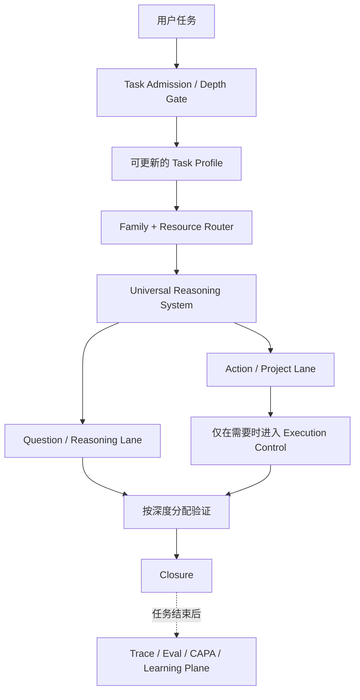

<div align="center">


# Reasoning Workflow

### 先想清楚，再搜索。

**理解真正的问题 · 分配合适的深度 · 研究真正重要的证据 · 让长期任务始终保持一致**

一套面向 AI Agent 的通用推理与 Deep Research 治理系统。

<br />

[](./skills/reasoning-workflow/SKILL.md)
[](#deep-research-不是关键词搜索)
[](#先判断任务深度再分配能力)
[](#上下文渐进加载)
[](#长期任务的语义运行时)
[](./LICENSE)

<br />

[English](./README.md) · **简体中文**

<br />

[快速开始](#快速开始) · [为什么存在](#为什么需要-reasoning-workflow) · [整体架构](#它如何工作) · [任务深度](#先判断任务深度再分配能力) · [Deep Research](#deep-research-不是关键词搜索) · [Skill Families](#skill-families) · [运行时](#长期任务的语义运行时) · [验证状态](#当前验证状态)

</div>

---

## 30 秒理解它

很多 AI 调研仍然是这样开始的：

```text
用户问题
   ↓
提取关键词
   ↓
搜索
   ↓
更多来源
   ↓
总结
```

真正的问题是：

> **如果模型在搜索之前就理解错了问题，搜索得越多，可能只是让错误答案看起来越可信。**

Reasoning Workflow 把起点向前移动，而且在昂贵工作开始之前再加一层判断：

```text
用户问题 / 任务
        ↓
极轻量 Task Admission / Depth Gate
        ↓
理解真正任务
        ↓
问题模型 / 问题图
        ↓
关键依赖 + 关系
        ↓
竞争解释 + 不确定性
        ↓
证据需求
        ↓
研究 / 观察 / 调用专业 Skill
        ↓
更新 + 反驳
        ↓
回答 / 决策 / 执行
        ↓
验证
```

> **搜索是推理的下游。深度是任务的下游。**

短翻译、直接计算应该保持很轻；复杂、争议性、因果性、时效性研究才展开为 Deep Research；长期、多产物、多 Agent 的现实任务才进一步进入 Execution Control、Checkpoint、Recovery 等运行层。

系统是通用的，但投入必须是成比例的。

---

# 为什么需要 Reasoning Workflow

现在的 Agent 已经可以搜索、写代码、分析文件、调用工具、使用专业 Skills、委派子 Agent。真正难的是：**在调用这些能力之前，决定到底应该做什么。**

Reasoning Workflow 主要解决这些常见失败：

- 围绕用户措辞回答，而没有解决真正的问题；
- 把问题拆成很多小问题，却无法重新组合回答根问题；
- 把相关、依赖、中介、因果、反馈混成一个“有关系”；
- 第一种合理解释出现后就停止寻找竞争解释；
- 直接围绕关键词搜索，而不是从证据需求产生检索；
- 把同源转载误认为多个独立证据；
- 简单任务过度思考、复杂任务又思考不足；
- 因为“可能有用”就把大量 reference 一次性塞进上下文；
- 长期任务里 Worker、文件、结论、测试和状态逐渐漂移；
- 因为产物“看起来完成了”就宣布任务完成；
- 从一次偶然失败中“学到经验”，然后未经验证直接改变未来行为。

这套 Workflow 把它们看成一个统一问题：**推理质量、资源分配、证据质量、运行状态、验证和学习必须保持连接。**

---

# 它如何工作



通用推理主干保持不变：

```text
真实任务 / 结果
→ 框架不确定时先定向探索
→ 建立可修改的问题模型
→ 找到关键依赖
→ 拆解 ↔ 重新组合
→ 建立关系 / 因果链
→ 保留竞争解释
→ 找到决定性不确定性
→ 形成证据需求
→ 推理 / 调研 / 观察
→ 更新并挑战模型
→ 综合 / 决策
→ 回答或执行
→ 验证
```

它是一张依赖关系地图，不是固定线性清单。新证据可以让 Agent 回到上游重新建模；不适用的步骤可以压缩到接近零开销。

---

# 先判断任务深度，再分配能力

所有 substantive task 都可以进入 Reasoning Workflow，但：

> **Universal entry ≠ Universal full execution**

第一步只是一个很轻的 Task Profile。它把不同维度分开，而不是制造一个假的“复杂度 87 分”：

```text
任务深度
推理广度
证据深度
挑战深度
验证深度
治理深度
问题框架不确定性
时效性 / 波动性
因果 / 系统复杂度
任务耦合程度
持久化 / 外部副作用
路由置信度
自主权限 / 授权
```

四种公开深度：

| 深度 | 典型行为 |
| --- | --- |
| **Light** | 直接完成。很多情况下 0 reference，不制造流程。 |
| **Standard** | 需要时做结构化推理和正常验证。 |
| **Deep** | 更完整的问题模型、证据工作、反驳和关键结论独立复核。 |
| **Max** | 最大“有用”深度，不等于“全部打开”。必要时增加正交证据路线和更深验证。 |

深度不是一次判断永久不变。发现隐藏复杂度可以升级；发现事情其实很简单，也允许降级。

模型负责理解任务并形成结构化 Task Profile；确定性 Router 根据这个 Profile 选择 Skill Families 和资源。**原始 prompt 关键词不是确定性分类器。**

---

# Deep Research 不是关键词搜索

这套项目最初就是从一个问题开始的：

> **Research should follow the structure of the problem, not merely the wording of the prompt.**

研究循环是：

```text
问题图
  ↓
不确定前提 / 因果边 / 假设
  ↓
明确的证据需求
  ↓
最接近这个证据的来源或工具
  ↓
观察底层材料
  ↓
更新问题模型
  ↓
传播影响
  ↓
反证 / 竞争解释
  ↓
下一次信息增益决策
```

## 问题框架不确定 ≠ 答案不确定

**答案不确定：** 问题基本正确，只是不知道答案。

**问题框架不确定：** 当前问题模型可能漏掉了行为者、机制、定义、时间边界、来源生态、激励、混杂变量或相邻领域。

因此在 frame uncertainty 很高时，可以先做 **orientation retrieval** 去认识领域；而进入正式 **evidence retrieval** 时，则应当已经有当前问题模型和明确证据需求。

这同时避免两个极端：

```text
一上来就关键词搜索
```

以及：

```text
为了形式主义，必须先填完一套模型才允许探索
```

## 证据的目标是区分，而不是堆积

重要问题会继续问：

- 这个来源真的有资格知道这件事吗？
- 实体、版本、时间、群体、定义是否一致？
- 看起来独立的几个来源是不是都来自同一个原始消息？
- 这个证据真的能区分两个解释，还是两个解释都说得通？
- 什么证据出现时，我应该改变结论？

```text
20 篇重复同一来源的文章
<
1 个能够区分两个竞争解释的观察
```

Deep Research 的停止条件也不是来源数、搜索数、Agent 数或者报告字数，而是：下一次可行研究还能不能实质改变答案、信心、决策或关键不确定性。

---

# Skill Families

详细能力被组织为六个较粗粒度的 Family，而不是把 23 个 reference 全拆成互相竞争的 Skill。

| Family | 负责什么 | 什么时候进入 |
| --- | --- | --- |
| **Core Reasoning** | 问题定义、深度分配、问题建模、拆解/重组、整合 | substantive task |
| **Deep Research** | 因果/系统建模、假设、证据需求、检索、来源链、不确定性 | 外部证据、争议事实、frame uncertainty、Deep/Max 调研 |
| **Decision Analysis** | 目标、约束、备选方案、后果、测量、权衡 | 推荐、优先级、选择、决策 |
| **Execution Control** | Plan、Schedule、授权、委派、持久状态、checkpoint/recovery | 长任务、多产物、Swarm、外部副作用 |
| **Audit / Verification** | 独立复核、对抗审查、Skill adherence、完成判断 | Deep/Max、高后果任务、明确审计 |
| **Workflow Learning** | CAPA、经验记忆、路由经验、受控改进 | 只在 post-run maintenance 使用 |

机器可读路由表在 [`routing-index.json`](./skills/reasoning-workflow/routing-index.json)，人类可读 Family 索引在 [`families/`](./skills/reasoning-workflow/families/)。

Reasoning Workflow 负责的是：**如何理解、如何路由、如何整合、如何验证、如何完成。** 专业实现仍然交给专业 Skill。

---

# 上下文渐进加载

目标不是让仓库变小，而是让当前模型上下文保持小而高信号。

```text
Task Profile
    ↓
Family route
    ↓
当前 unresolved gap
    ↓
本阶段真正有用的 1–3 个 reference
    ↓
返回 Router
```

默认规则：

- Light 且没有结构化 gap 时可以 **0 reference**；
- 正常阶段只加载少量真正有用的 reference；
- Max 可以逐渐加载更多，但仍然按阶段加载；
- `Related` 只是导航提示，不会触发递归加载；
- schema、lifecycle policy、validator 尽量留在机器层，让模型调用，而不是让模型背下来；
- reference load 带 route / gap / profile 信息，可以真正测量“加载了但没用”的上下文浪费。

---

# 两条一等 Lane

## Question / Reasoning Lane

一个问题本身就是完整任务：

```text
理解
→ 建模
→ 推理 / 调研
→ 反驳
→ 重新组合
→ 回答
→ 验证
```

不会因为问题很难，就强行引入项目管理状态。

## Action / Project Lane

只有当任务真的会改变现实状态时，才向执行扩展：

```text
推理
→ 决定应该做什么
→ Plan
→ Authorization
→ Schedule / Delegate
→ Execute
→ Re-observe
→ Verify
→ Reconcile
→ Effectiveness
→ Close / Reopen
```

Swarm 只是这一条 Lane 下方的调度方式，不是第三条推理 Lane。

---

# 长期任务的语义运行时

当长期执行确实需要时，模型推理外面会增加确定性的状态和验证机制。

核心对象包括：

```text
Task Profile        — 这次任务应该启用多少机制
Problem Model       — 当前到底在解决什么
Canonical State     — 当前哪些状态真的有效
Execution Plan      — 应该做什么
Execution Schedule  — 谁、何时、如何做
Node State Ledger   — 实际做到哪里
Worker Proposal     — Worker 的候选发现/修改，不是系统真相
Checkpoint          — 可恢复的语义/运行时/工作区绑定
Verification        — 到底验证了哪一个状态/内容
Learning Record     — 被验证的可复用经验
```

两个核心原则：

> **Declared state is input. Effective state is computed.**

> **Validator 能证明结构与内部一致性，不等于能证明现实世界中的真伪。**

上游 premise、evidence、relationship、artifact fingerprint、requirement 或 verification 发生变化时，下游状态必须重新计算，不能悄悄保持 current。

---

# 串行、Swarm、降级与恢复

同一个语义 Plan 可以有不同 Schedule：

```text
同一个 Plan
   ├── 单 Agent 串行
   ├── 多 Worker 并行处理独立节点
   └── 能力缺失时使用受控降级路线
```

Plan 的语义不能因为调度方式改变。

Worker 可以独立发现信息，但不能独立定义 canonical reality。它返回结构化 proposal，由 controller / validator 检查版本、contract、write-set 冲突、证据和 verification 后才能合并。

恢复流程是：

```text
restore
→ 验证 checkpoint
→ 重新检查 capability + authorization
→ 重新观察容易变化的外部状态
→ 检查副作用是否已经提交
→ 重算 stale state
→ 重新打开受影响节点
→ resume
```

Replay Safety 区分 safe、idempotent、detectable、unsafe，避免中断后重复执行不可逆副作用。

---

# 双层交叉验证

验证也按深度分配。

**第一层：Local / Contract Verification**

检查它是否正确完成了自己声称完成的工作：需求、引用、计算、测试、文件 contract、版本和覆盖范围。

**第二层：Independent / Adversarial Verification**

问一个不同的问题：它是否真的解决了根问题？Solver 和第一层是不是共享了同一个盲区？

Deep 和高后果任务可以要求 fresh reviewer；Max / 高后果任务必要时再增加正交的 evidence / tool / model / deterministic / human 路线。

同一个 Agent、同一个上下文再看一遍，不自动等于独立验证。

Reviewer 冲突也不是投票解决，而是重新打开争议节点，产生新的定向证据/验证需求。

---

# Skill 是否真的被执行

最终答案写得很漂亮，不代表 Agent 真按 Workflow 做过。

Adherence 层检查的是可观察协议：

```text
state preconditions
+ required transitions
+ forbidden transitions
+ tool / resource loads
+ events
+ validator findings
```

例如正式 evidence retrieval 不应该在没有 evidence need 的情况下静默发生；但一个从 checkpoint 恢复的任务，如果 canonical state 已经有有效前提，也不需要为了形式主义重新制造相同事件。

它不记录模型的私有 chain-of-thought，而是检查可观察状态、行动、证据、产物和转换。

---

# 受控自我学习

Reasoning Workflow 可以从经验中学习，但一次任务不能直接改写 canonical workflow。

```text
经过验证的成功 / 失败 / 恢复 / 低效率轨迹
        ↓
CAPA 风格 Root Cause Analysis
        ↓
Candidate Learning
        ↓
Eval Gates
        ↓
Promote / Reject
        ↓
始终保留 Rollback
```

分三层：

- **Experience Memory**：经过验证的策略、恢复和效率经验，可选择性检索；
- **Routing Heuristics**：修改深度/路由/reference 的经验必须经过 held-out eval；
- **Canonical Workflow Changes**：修改 Skill、schema、policy、validator、authorization、closure 必须有 regression、baseline comparison、独立审查和 rollback。

同模型在没有新信息时“自己反思了一下”，最多生成 Candidate Insight，不能自己验证自己。

详见 [`docs/LEARNING-POLICY.md`](./docs/LEARNING-POLICY.md)。

---

# 快速开始

## 方案一：直接使用仓库源码

```text
读取 skills/reasoning-workflow/SKILL.md，并把 Reasoning Workflow 作为这个任务的 governing workflow。

我的任务：
[写你的真实问题或任务]
```

做 Deep Research：

```text
使用这个仓库里的 Reasoning Workflow 深入研究下面的问题。
先理解问题结构和证据需求，再决定如何检索；不要从关键词扩展直接开始。
使用最大“有用”深度，但不要增加不能改善答案的流程。

[我的问题]
```

## 方案二：Portable 单 Skill 包

推荐给大多数用户和大多数 runtime：

[`dist/reasoning-workflow-portable.zip`](./dist/reasoning-workflow-portable.zip)

它包含一个 `reasoning-workflow` Skill，以及 thin router、六个 Family 索引、progressive references、schemas、validators、runtime、tests 和 eval adapters。

安装后：

```text
Use $reasoning-workflow as the governing workflow for this task:

[your task]
```

## 方案三：Modular 多 Skill 包

适合原生支持 Skill discovery / composition 的高级 runtime：

[`dist/reasoning-workflow-modular.zip`](./dist/reasoning-workflow-modular.zip)

包含六个可独立发现的 Skill：

```text
reasoning-core
deep-research
decision-analysis
execution-control
audit-verification
workflow-learning
```

六个 Skill 由同一个 Source of Truth 自动生成，并通过共享 machine semantics hash 检查一致性。

> [!IMPORTANT]
> Portable 和 Modular 是同一个系统的两种发行方式，不是两套独立实现。不要人工分别维护。

---

# 我该用哪一个？

| 形态 | 适合 | 特点 |
| --- | --- | --- |
| **Repository source** | 开发者、源码审查、继续扩展 | 完整 canonical development tree |
| **Portable** | 绝大多数用户、上传 ZIP、单 Skill runtime、跨平台 | 一个 governing Skill 内部负责路由 |
| **Modular** | Skill discovery / composition 很强的高级 runtime | 六个 Family 独立发现，但磁盘上会有自包含资源重复 |

不知道选哪个时，选 **Portable**。

---

# 仓库结构

```text
.
├── README.md
├── README.zh-CN.md
├── LICENSE
├── CONTRIBUTING.md
├── PRIVACY.md
├── TERMS.md
│
├── skills/
│   └── reasoning-workflow/       # canonical source of truth
│       ├── SKILL.md
│       ├── families/
│       ├── references/
│       ├── schemas/
│       ├── scripts/
│       ├── tests/
│       ├── evals/deep-research/
│       ├── agents/
│       └── assets/
│
├── dist/
│   ├── reasoning-workflow-portable.zip
│   └── reasoning-workflow-modular.zip
│
└── docs/
    ├── ARCHITECTURE.md
    ├── EVALUATION.md
    └── LEARNING-POLICY.md
```

仓库源码是唯一 canonical truth，两个发行 ZIP 都由它生成。

---

# 当前验证状态

当前 deterministic build：

- **44 / 44** 当前可发现的 unit / regression tests 通过；
- 保留 **24** 个 behavioral specifications；
- 包含 routing、context、adherence、learning、Deep Research contract、runtime、distribution 测试；
- Portable ↔ Modular 共享语义 hash 一致性检查通过；
- ZIP integrity 检查通过。

目前已经能机器验证的典型行为包括：

- Light 任务可以保持 Light，且加载 0 reference；
- Task Profile 改变后旧 route 自动 stale；
- `Related` 不会引发 reference cascade；
- evidence retrieval 需要 evidence need，但 frame uncertainty 高时仍允许 orientation；
- Skill 默认规则不能覆盖用户明确指令（独立安全/授权约束除外）；
- fresh review 和 orthogonal review 不会混为一谈；
- intrinsic reflection 不能直接升级 canonical learning；
- unsafe side effect 的恢复遵守 Replay Safety。

验证命令与评估边界详见 [`docs/EVALUATION.md`](./docs/EVALUATION.md)。

## 仍然没有被证明的东西

Deterministic tests 能验证 workflow implementation，但不能自动证明任何模型 / runtime 都会正确执行 Skill。

以下仍然需要真实 matched behavioral eval：

- 模型 Task Profile 分类准确率；
- Skill trigger、Family 和 reference selection 的 precision / recall；
- Deep Research 真实生成质量相对冻结 baseline 的 non-inferiority；
- 真实 token / latency / tool-call 减少；
- Dual Review 是否真的减少高价值错误；
- 长期自学习的有效性和 harmful-memory rate；
- 完整外部 Deep Research benchmark；
- 不同 runtime 下除 hash 之外的真实行为一致性。

这个边界会长期保持公开。

---

# 设计原则

> **Search is downstream of reasoning.**

> **Universal entry does not mean universal full execution.**

> **Rigor is not ceremony.**

> **Plan semantics are invariant under scheduling.**

> **Workers may discover independently; they may not define canonical reality independently.**

> **Declared state is input; effective state is computed.**

> **Verification is valid only for the state/content it actually verified.**

> **Self-learning is controlled experience reuse, not automatic self-editing.**

> **漂亮的输出，不等于 Workflow 真的被执行。**

---

# 参与开发

推荐的开发方式是 regression-first：

```text
找到一个具体失败
→ 保存最小反例
→ 先让测试 FAIL
→ 修改真正负责这条语义的层
→ 让测试 PASS
→ 跑更广泛 regression / eval
→ 保留 rollback
```

新增规则前先问它应该属于：

```text
Reasoning Core
专业 Family / reference
Schema / policy / validator
Runtime / harness
Eval / trace system
```

详见 [`CONTRIBUTING.md`](./CONTRIBUTING.md)。

---

# License / Privacy / Terms

MIT License，见 [`LICENSE`](./LICENSE)。

Reasoning Workflow 本身只是 Skill / Workflow 包，不运行自己的托管后端。见 [`PRIVACY.md`](./PRIVACY.md) 和 [`TERMS.md`](./TERMS.md)。

---

<div align="center">

**Reasoning Workflow**

*先理解，再研究；按需行动；只验证当前真正有效的东西。*

</div>
