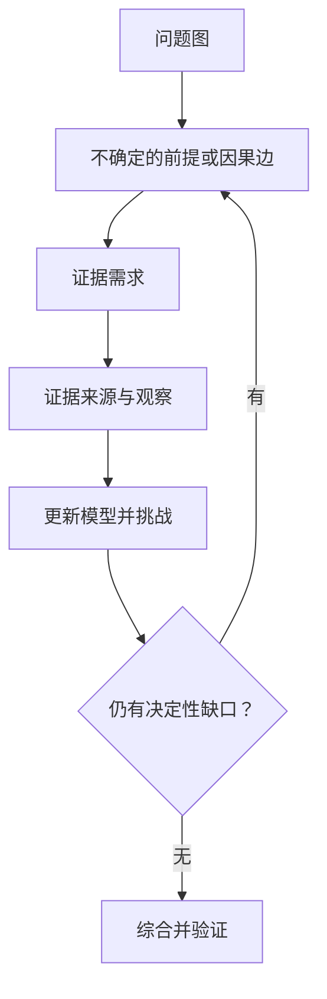

<div align="center">


# Reasoning Workflow

### 让 AI 在搜索之前，先学会思考

理解真正的问题 · 分配合适的深度 · 研究真正重要的证据 · 让长期任务保持一致

[English](./README.md) · **简体中文**

[快速开始](#快速开始) · [实际用法](#实际用法) · [工作原理](#工作原理) · [验证与边界](#验证与边界)

**[下载 Portable](./dist/reasoning-workflow-portable.zip)** · [下载 Modular](./dist/reasoning-workflow-modular.zip) · [阅读 Skill](./skills/reasoning-workflow/SKILL.md)

</div>

---

## 好的工作，从调用工具之前开始

Agent 可能引用了可靠来源，却回答了错误的问题；也可能写出漂亮的计划，却漏掉关键依赖，或在证据变化后继续使用失效结论

Reasoning Workflow 是一套用于**推理、调研、决策与执行的 governing Skill**，帮助 Agent 判断真正需要理解什么、什么证据能改变结论、何时调用专业能力，以及完成前应该验证什么

它与编程、设计、文档等专业 Skill 协作，不替代它们，也不提供模型本身、工具访问权或操作授权

**简单任务保持简单**：直接计算不需要研究计划，复杂调查也不应退化成关键词搜索

## 快速开始

### 复制这段，让 Agent 帮你安装

把下面整段发给你使用的 Agent，无需先研究仓库目录

```text
请在当前环境中安装并配置 Reasoning Workflow
仓库：https://github.com/zy839971925-zyy/Agent--deep-research-Workflow-Skills

先读取仓库 README.md 和 skills/reasoning-workflow/SKILL.md
检查当前宿主支持的 Skill / Plugin 安装机制和是否已有同名实例

已有实例时优先更新，不重复安装，也不覆盖尚未保存的本地修改
默认选择 Portable 单一 governing Skill
只有当前宿主适合组合多个 Family Skill 时才选择 Modular
优先使用宿主正式支持的安装器，不要猜测安装目录或执行未经检查的远程脚本
如果需要克隆源码，使用临时目录并保留 Skill 所需的完整相对目录结构

有现成权限就直接完成
如果需要授权、登录或重启，请说明具体阻塞和最小必要操作
如果环境不支持持久安装，说明限制，并在可读取文件的前提下用于当前会话

最后验证入口文件可读、依赖资源存在、宿主是否识别
报告安装位置、来源 commit、实际验证结果，以及是否还需要重启
不要把下载完成或读过文件当成安装成功
```

这是一段**交给 Agent 执行的安装请求**，不是所有平台通用的一键安装接口，能否全自动完成取决于宿主能力与权限

### 选哪一种方式？

| 方式 | 适合谁 | 实际得到什么 |
| --- | --- | --- |
| **[Portable](./dist/reasoning-workflow-portable.zip)** | 大多数用户，建议从这里开始 | 一个完整的 `reasoning-workflow/` governing Skill，内部按需路由六个 Family |
| **[Modular](./dist/reasoning-workflow-modular.zip)** | 支持多 Skill 发现与组合的进阶运行时 | 六个 Family Skill，共享机器语义 |
| **[仓库源码](./skills/reasoning-workflow/)** | 开发者、审计者、贡献者 | canonical Skill、资源、脚本和测试 |

手动安装时，解压后使用宿主支持的安装方式：Portable 选择包含 `SKILL.md` 的目录，Modular 使用 `reasoning-workflow-modular/skills/` 下的六个目录，不建议为同一用途同时安装两种格式

仓库提供了兼容宿主可使用的 [Plugin manifest](./.codex-plugin/plugin.json)，但安装、发现、工具调用和持久化仍由宿主决定

### 暂时不安装，也可以开始

让能够访问本仓库的 Agent 读取入口，然后直接给任务

```text
读取 skills/reasoning-workflow/SKILL.md，并用它处理以下任务

任务：[你想了解或完成什么]
约束：[范围、来源、期限或操作权限]
交付：[需要的答案、决策或文件]

选择与任务匹配的深度，只在需要时加载支持资源
```

如果环境只支持上传文件，可上传解压后的文件，或在环境支持解压时上传 ZIP，再请 Agent 读取入口，**读取附件不等于持久安装**，一个无法访问的路径也不会自动加载 Skill

## 实际用法

不必为每个任务写很长的提示词，说明目标和真正重要的约束即可

### 调查一个说法

```text
使用 Reasoning Workflow 调查 [某个说法] 是否成立

区分一手证据和重复报道，考虑其他解释
指出什么证据会改变判断，给出有来源的结论和剩余不确定性
```

### 做一个决策

```text
使用 Reasoning Workflow 比较 [方案 A] 和 [方案 B]，目标是 [目标]

我的约束是 [约束]
找出决定性的取舍，区分事实与假设，并说明什么情况下建议会改变
```

### 完成一次有边界的修改

```text
使用 Reasoning Workflow 在这个仓库中实现 [修改]

保留 [不可破坏的约束]，允许修改的范围是 [范围]
验证结果，并报告改了什么、哪些检查通过、还有什么未解决
```

小任务可以补一句“保持轻量”；调研任务应说明重要的不确定性，而不是只要求更多来源；执行任务应明确授权范围，Skill 不会自动补齐缺失的权限

## 工作原理

架构由 **Universal Reasoning System、Depth-Gated Skill Routing、Progressive Context Disclosure、Deterministic Semantic Runtime、Dual-Layer Verification 和 Eval-Gated Self-Learning** 组成

### 1. 先决定深度，再投入成本

轻量的 **Task Admission / Depth Gate** 形成 Task Profile，分别判断推理、证据、挑战、验证与治理深度，并随任务暴露的新不确定性调整

| 深度 | 典型任务 | 验证方式 |
| --- | --- | --- |
| **Light** | 直接、清晰的小任务 | 最小必要检查 |
| **Standard** | 有边界的分析或实现 | 常规验证 |
| **Deep** | 重要不确定性、因果问题、争议证据 | 重要结论使用 Layer 1 + fresh Layer 2 |
| **Max** | 明确要求最大有用深度，或高后果任务 | 两层验证，必要时增加正交路径 |

**Universal entry ≠ universal full execution**：所有 substantive task 都可以进入，但不需要执行全部机制，Light 且没有 structured gap 时可以加载 **0 个 reference**，Max 也不等于最多 token、搜索或 Agent

### 2. 沿着问题结构研究，而不是只沿着提问措辞搜索

**Universal Reasoning Spine** 连接问题框定、建模、前提、拆解与重组、关系、不确定性、证据、挑战、综合与验证，它是可修订的推理地图，不是必须逐项执行的清单

Deep Research 从 **Problem Graph** 出发，识别哪些主张、假设、依赖和因果链上的不确定性会改变答案



例如，“新品发布导致销量下滑了吗？”需要检查时间顺序、指标口径、对照与其他原因，而不只是搜索新品名称

如果问题框架本身还不清楚，可以先做 **orientation retrieval**，认识概念与背景；正式的 **evidence retrieval** 则需要明确 evidence need：哪一种观察能解决不确定前提，或区分竞争解释

> Research should follow the structure of the problem, not merely the wording of the prompt

### 3. 只加载当前缺口需要的资源

上下文渐进加载遵循 **Task Profile → Family Route → Current Gap → Small Reference Shortlist**，当前阶段通常只加载最相关的 **1–3 个 references**

| Skill Family | 解决什么问题 |
| --- | --- |
| [Core Reasoning](./skills/reasoning-workflow/families/core-reasoning.md) | 问题框定、模型、前提、关系与综合 |
| [Deep Research](./skills/reasoning-workflow/families/deep-research.md) | 证据需求、调查、来源链与竞争解释 |
| [Decision Analysis](./skills/reasoning-workflow/families/decision-analysis.md) | 选项、取舍、不确定性与建议 |
| [Execution Control](./skills/reasoning-workflow/families/execution-control.md) | 依赖、授权修改、委派与恢复 |
| [Audit / Verification](./skills/reasoning-workflow/families/audit-verification.md) | 合同检查、独立复核与完成判定 |
| [Workflow Learning](./skills/reasoning-workflow/families/workflow-learning.md) | 运行后的经验、CAPA 与经过评估的改进 |

**Related ≠ automatic load**：用完 reference 后回到 Router，重新判断缺口，不沿 related 链递归加载整个资源库，详见 [routing index](./skills/reasoning-workflow/routing-index.json)

机器密集资源遵循另一条原则：**机器使用，模型调用，模型不必背下来**

### 4. 回答问题，或推进项目

只有两条第一等 Lane

- **Question / Reasoning Lane**：理解、调查、综合、回答、验证，一个经过验证的答案就是完整成果
- **Action / Project Lane**：在推理之上增加计划、授权执行、重新观察、对齐与完成判定

Agent Swarm 属于调度，不是第三条 Lane；Audit 是验证层；Learning 是运行后的维护

<details>
<summary><strong>长期任务：状态、委派与恢复</strong></summary>

**Semantic Runtime** 提供 typed lifecycle、effective-state propagation、canonical logical dependency graph、Execution Node State Ledger 和 closure checks

**Declared state is input. Effective state is computed**：前提或文件改变后，下游结果可能失效，验证只对实际检查过的状态或内容指纹有效

- **Plan / Schedule separation**：Plan 定义依赖和合同，Schedule 分配时间与 Worker，调度变化不能改变 Plan 语义
- **Agent Swarm**：综合依赖独立性、上下文独立性、共享可变状态、合并成本、失败隔离和证据多样性决定是否并行，复杂任务不自动启动 Swarm
- **Worker Proposal**：Worker 可以独立发现，但不能独立写入 canonical reality，Manager / deterministic merger 验证 proposal 并处理冲突后，才更新权威状态
- **Capability / Authorization separation**：工具可用不等于有权使用
- **Checkpoint / Recovery**：恢复、重新观察、重算有效状态，再继续
- **Replay Safety**：通过 side-effect receipt 等机制约束重试，避免中断后盲目重复副作用

这些是合同与可执行辅助工具，不是一直运行的托管编排服务，宿主必须实际调用对应 runtime 和 validator，机器约束才会生效

详见 [架构](./docs/ARCHITECTURE.md) 和 [语义合同](./skills/reasoning-workflow/references/semantic-state-contract.md)

</details>

## 验证工作本身，不只验证表达

**Dual-Layer Verification** 分开回答两个问题

- **Layer 1**：工作是否正确满足自己声明的 contract
- **Layer 2**：是否真正解决原始问题，有没有问题漂移、遗漏分支、共同盲点、来源污染、新矛盾或意外后果

同一个 Solver 在同一个上下文里重读答案，不自动算独立复核；Reviewer 冲突需要重新打开争议节点并针对性验证，不能通过投票结束

**Skill Adherence** 与成品质量也不是同一件事，需要检查可观察的状态前提、必要与禁止的转换、事件、工具调用、资源加载和 validator findings，漂亮答案不是遵循 Workflow 的证明，既不要求也不把 private chain-of-thought 当作审计材料

<details>
<summary><strong>改进 Workflow，但不自动改写自己</strong></summary>

Controlled Learning 分为三个 Tier

1. **Experience Memory**：保留有边界的可用经验
2. **Routing / Reference Heuristics**：评估资源选择策略的改进
3. **Canonical Workflow Change**：必须经过候选、最小失败回归、offline/shadow eval、基线比较、独立复核、promote/reject，并具备回滚机制

**Self-Learning ≠ Automatic Self-Editing**：单次“生成 → 反思 → 改写 Skill”不能直接晋升为正式变更

重大 Workflow failure 使用 **CAPA**：遏制、根因、纠正措施、回归、验证、有效性检查、预防／泛化与关闭，单个测试通过不代表措施已经有效

详见 [学习政策](./docs/LEARNING-POLICY.md)

</details>

## 验证与边界

当前可复现状态

- **44/44** 当前可发现的 unit / regression tests 通过
- Skill 结构、内部链接与 workflow metadata 检查通过
- Portable / Modular 共享语义一致性与 ZIP 完整性检查通过

**这些是确定性实现检查，不是真实 Agent behavioral benchmark**

仍未验证：真实模型 Task Profile 分类、Skill trigger precision/recall、跨模型 Family/reference routing、匹配条件下 Deep Research 质量非劣性、真实 token/latency 节省、双重复核错误减少、长期学习有效性，以及完整外部 Deep Research benchmark

详见 [验证命令与边界](./docs/EVALUATION.md) 和 [Deep Research 评估定义](./skills/reasoning-workflow/evals/deep-research/)，实际效果取决于模型、宿主集成、可用证据与实际遵循情况

## 开发与贡献

唯一 canonical source 是 [`skills/reasoning-workflow/`](./skills/reasoning-workflow/)，Portable 与 Modular 是生成产物，不是两套分别维护的实现

在 canonical 目录运行

```sh
python -m pip install -r scripts/requirements.txt
python scripts/validate_skill.py .
python scripts/validate_links.py .
python scripts/validate_workflow.py .
python -m unittest discover -s tests -p 'test_*.py' -v
python scripts/build_distributions.py --source . --out-dir ../../dist
python scripts/validate_distribution.py ../../dist/reasoning-workflow-portable.zip ../../dist/reasoning-workflow-modular.zip
```

[Semantic manifest](./skills/reasoning-workflow/SEMANTIC_MANIFEST.json) · [发行校验值](./RELEASE-MANIFEST.json) · [贡献指南](./CONTRIBUTING.md)

---

[MIT License](./LICENSE) · [隐私](./PRIVACY.md) · [使用条款](./TERMS.md)
