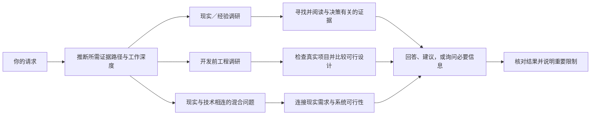

<div align="center">
  

  # Reasoning Workflow

  **一套帮助 AI 提出更好的问题、找到更可靠证据，并把事情做完的工作流。**

  [English](README.md) · [简体中文](README.zh-CN.md)

  [从 Skill 入口开始](skills/reasoning-workflow/SKILL.md) · [选择安装版本](#edition) · [技术架构](skills/reasoning-workflow/docs/TECHNICAL_ARCHITECTURE.zh-CN.md) · [下载 Portable 完整包](dist/reasoning-workflow-3.1.0.zip)
</div>

---

Reasoning Workflow 是一套供 AI Agent 使用的指引，以及可选的辅助工具。它帮助 Agent 弄清答案真正取决于什么，选择与任务相称的调研方法，并检查建议或交付是否符合需求。

它适用于现实问题调研、开发前的研究、决策、写作与代码，以及需要跨会话继续推进的工作。简单问题依然可以直接回答。工作流的目的是改善解决问题的路径，不是让每件事都变复杂。

> [!NOTE]
> 本仓库不是模型、搜索服务或权限系统。宿主应用决定 Skill 是否加载、可用模型与工具，以及允许执行哪些操作。Skill 指引本身不能强制激活，也不能证明模型确实照做。

## 从这里开始

1. **选择一个版本。** 不确定时，先用 Portable。
2. **安装完整 Skill 文件夹。** 放到 AI 宿主识别的目录；不要只复制 `SKILL.md`，它需要同目录的支持文件。
3. **在宿主中启用它。** 或将它设为宿主的默认工作流。各产品配置不同，可先看[宿主配置说明](skills/reasoning-workflow/references/harness-profiles.md)。
4. **像平时一样提问。** 工作流应根据情境推断调研路径和投入深度。想明确指定时，可以试试[下面的示例](#try-it)。
5. **检查结果。** 对高风险或易变问题，要求它给出决定性证据、不确定性和适用边界，而不只是一个肯定的结论。

<a id="edition"></a>

## 选择安装版本

|  | Portable | Modular |
|---|---|---|
| 适合谁 | 希望有一个统一入口和完整工作流 | 宿主已能发现并调度多个 Skill |
| 包含什么 | 入口 Skill、按需参考资料、Schema、可选 Python 工具和测试 | 六个独立的指令型 Skill，各自带参考资料 |
| 取舍 | 包更完整；仅在使用辅助工具时需要兼容的 Python 环境 | 不含 Portable 的 Python 辅助工具及跨 Family 共享运行时／状态层 |
| 从这里开始 | [`skills/reasoning-workflow/`](skills/reasoning-workflow/) | [`modular/README.md`](modular/README.md) |

首次安装推荐 Portable。Modular 不是六份各自包含所有 Portable 功能的完整副本；它更适合能可靠组合多个 Skill 的宿主。Modular 包含 `reasoning-core`、`deep-research`、`decision-analysis`、`execution-control`、`audit-verification` 和 `workflow-learning`。

### 安装 Portable

1. 克隆本仓库，或下载[完整 Portable 压缩包](dist/reasoning-workflow-3.1.0.zip)。
2. 把完整的 `reasoning-workflow` 文件夹放入宿主识别的 Skill 目录。例如，Codex 常用 `.agents/skills/reasoning-workflow/`，Claude Code 常用 `.claude/skills/reasoning-workflow/`。具体路径以宿主当前说明为准。
3. 按宿主要求启用或选择该 Skill。从 [`SKILL.md`](skills/reasoning-workflow/SKILL.md) 开始；它会根据任务需要指向其他资料。
4. 先发一个普通请求，再用[示例](#try-it)明确指定一次推理深度。

Python 辅助工具是可选的，依赖见 [`requirements.txt`](skills/reasoning-workflow/scripts/requirements.txt)。这些工具用于准备或校验任务记录，不会运行模型、激活 Skill，也不会执行现实世界操作。

### 安装 Modular

1. 打开 [Modular 指南](modular/README.md)，按宿主需求选择要安装的 Skill。
2. 将每个所选 Skill 的**完整文件夹**放入宿主识别的目录（例如 Codex 的 `.agents/skills/<skill-name>/`，或 Claude Code 的 `.claude/skills/<skill-name>/`）。
3. 启用宿主的原生 Skill 发现。可以从 `reasoning-core` 开始；涉及证据调研时再启用 `deep-research`，其他 Skill 按任务需要加入。

如果宿主支持 `skills` CLI，仓库指南提供了一个只安装指定 Skill 的示例：

```bash
npx skills add zy839971925-zyy/Agent--deep-research-Workflow-Skills --skill deep-research
```

CLI 和宿主的安装方式可能变化；如果命令或路径不可用，请以宿主当前文档为准。

## 工作流如何选择路径

你不需要先给任务贴上“现实问题”或“工程调研”的标签。遇到需要认真调查的问题时，Agent 会根据真正影响决策的问题，推断应该寻找哪类观察：

- **现实／经验问题：** 发生了什么、规模多大、影响谁、什么导致变化，或预期结果有哪些证据？
- **开发前工程／架构：** 在真实代码库、约束和质量目标下，哪些设计可行，关键取舍是什么？
- **相互关联的混合问题：** 人们需要什么，这个系统能否实现？先区分需求证据和技术可行性证据，再在决策处把两者连接起来。

默认使用宿主已经选择的模型。工作流会根据复杂度、不确定性、时效性、后果，以及新增证据能否改变答案，自动选择合适的投入深度：从 Light、Standard、Deep、Max 到 Ultra。这是工作投入程度，不代表切换模型、固定输出篇幅，也不会增加工具权限或行动授权。用户明确指定深度时，优先按指定深度执行，但仍受宿主实际能力限制。


```mermaid
flowchart LR
  A[你的请求] --> B[推断所需证据路径与工作深度]
  B --> C[现实／经验调研]
  B --> D[开发前工程调研]
  B --> E[现实与技术相连的混合问题]
  C --> F[寻找并阅读与决策有关的证据]
  D --> G[检查真实项目并比较可行设计]
  E --> H[连接现实需求与系统可行性]
  F --> I[回答、建议，或询问必要信息]
  G --> I
  H --> I
  I --> J[核对结果并说明重要限制]
```

面对因果问题，因果链是待检验的假设，不是证明。搜索应沿着可能改变结论的环节展开，检查竞争解释和适用边界，并阅读原始材料，而不是只信摘要或重复引用。面对架构问题，应先检查实际仓库和需求，再推荐设计。详见[检索与观察](skills/reasoning-workflow/references/retrieval-and-observation.md)和[研究模式与方法](skills/reasoning-workflow/references/research-modes-and-methods.md)。

<a id="try-it"></a>

## 试着使用

Portable 入口的设计目标是：当宿主将它作为默认入口提供时，对每条请求静默做轻量分流。你也可以对当前请求明确调用：

> **“调用我的 workflow skills，评估这个课后辅导项目能否提高数学成绩、对哪些学生有效，以及什么证据会改变结论。”**
>
> 预期路径：现实／因果调研。工作流应区分成绩效果与可能机制、替代解释，再调查那些可能改变结论的关键缺口。

> **“开始开发前，请先检查这个代码库，为离线课表编辑和可靠恢复设计架构。使用我的 workflow skills 的 Ultra 深度。”**
>
> 预期路径：开发前工程调研，并按明确要求使用 Ultra 深度。Agent 应检查现有项目证据，按约束比较设计；Ultra 本身不代表授权改代码。

> **“使用我的 workflow skills 的 Ultra 深度，查明学生是否需要这个恢复功能，以及我们的离线 App 能否安全支持它。”**
>
> 预期路径：现实需求与技术可行性相连的混合调研。需求证据和工程证据应分别说明，再连接到建议中。

> **“简单回答即可，尽量轻量；除非有关键事实不确定，否则不用做大范围调研。”**
>
> 预期路径：Light 或同样精简的处理方式，直接回答；只有剩余不确定性会实质影响答案时，才做针对性核查。

说 **“调用我的 workflow skills”** 会为当前请求选择该工作流；它本身不等于 Ultra。想明确使用 Ultra，可以说：**“使用我的 workflow skills 的 Ultra 深度去思考调研。”** 如果希望既调用又使用 Ultra，把两项要求都说清楚。

## 没有按预期工作时

- **宿主没有识别到 Skill：** 检查完整文件夹是否放在正确的宿主目录，并确认已开启 Skill 发现。部分宿主只会尽力匹配。若要求每条请求都先经过工作流，需要在宿主中配置可信的常驻指令或前置路由；Skill 文件不能强制自己加载。
- **主动调用短语没有效果：** 把它作为你当前请求中的指令，不要只放在引文、文件或其他资料里；并确认当前宿主界面支持此 Skill。
- **简单问题收到太多流程：** 明确要求直接回答或 Light。深度影响调查投入，不应强制长报告、固定章节或增加 Agent。
- **Ultra 好像切换了模型或触发了操作：** 这不应发生。Ultra 只改变工作流投入程度，不切换模型、不增加权限，也不授权执行。
- **Agent 说搜索过，却没有可用证据：** 要求它指出实际打开的来源，并说明来源如何支持关键主张。账号已连接或产品介绍中有某功能，不代表本次运行确实使用了它。
- **Skill 只有部分内容可用：** 重新安装完整文件夹，不要只复制入口文件。使用 Modular 时，还要确认安装并启用了与当前任务有关的 Skill 及其参考资料。

如果宿主没有提供需要的搜索工具、连接器、权限或运行时辅助工具，工作流应尽可能使用受支持的替代路线，并说明剩余限制；它不能凭空创造宿主未开放的能力。

## 测试能说明什么

自动化检查覆盖 Schema、链接、辅助工具、包内容和协议场景等结构契约，可以发现这些方面的回归；但它们**不能证明模型会遵循每条指引，也不能证明调研质量提高**。要评估实际效果，需要在模型、宿主、工具和预算可比的条件下，对同一组任务进行有／无工作流的对照，并评阅答案及可观察的证据收集过程。

同样，计划、检查点或子代理报告也不能证明外部操作已经发生。宿主必须提供真实结果，并执行自身的权限和操作规则。

## 仓库导航

- [`skills/reasoning-workflow/`](skills/reasoning-workflow/)：Portable 入口、方法、Schema、可选工具和包内测试。
- [`modular/`](modular/)：供宿主原生路由使用的分体 Skill。
- [`tests/`](tests/)：仓库级宿主契约测试。
- [`dist/`](dist/)：Portable 版本包及校验和。
- [技术架构报告（简体中文）](skills/reasoning-workflow/docs/TECHNICAL_ARCHITECTURE.zh-CN.md) · [Technical architecture (English)](skills/reasoning-workflow/docs/TECHNICAL_ARCHITECTURE.md)
- [贡献指南](CONTRIBUTING.md) · [隐私说明](PRIVACY.md) · [使用条款](TERMS.md) · [MIT 许可证](LICENSE)

<sub>由 <a href="https://github.com/zy839971925-zyy">折鸢 / zy839971925-zyy</a> 维护。</sub>
